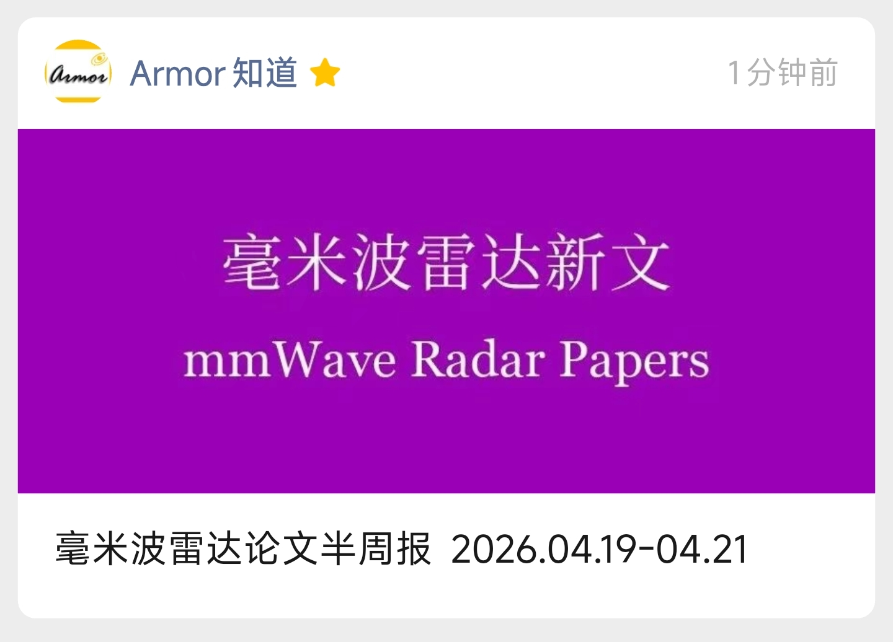

# mmWave Radar Daily Papers

毫米波雷达相关论文简报归档，人工筛选后整理。

更新频率：每周三、周日。

移动端可关注公众号同步推送

<table>
  <tr>
    <td align="center" width="50%">
      
    </td>
    <td align="center" width="50%">
      
    </td>
  </tr>
</table>

## 最新一期

[独立页面：2026-04-19 至 2026-04-21](daily/2026-04-19_to_2026-04-21.md)

历史归档

- [2026-04-19 至 2026-04-21](daily/2026-04-19_to_2026-04-21.md)
- [2026-04-15 至 2026-04-18](daily/2026-04-15_to_2026-04-18.md)

## 毫米波雷达论文半周报 2026-04-19 至 2026-04-21

- 日期：2026-04-19 至 2026-04-21
- 论文数：46

### 铁路场景3D目标检测：全面综述

原英文标题：3D Object Detection for Railway: A Comprehensive Survey

作者：Lirong Lian, Yong Qin, Zhiwei Cao, Yang Gao, Zhenhao Liu, Qiao Li, Xiaoqing Cheng

出版来源：IEEE Transactions on Instrumentation and Measurement

出版时间：2026-03-30

原英文摘要：Reliable 3D perception is indispensable for the next generation of autonomous railways (GoA4). This paper presents a comprehensive survey of 3D object detection tailored for railway environments. Unlike conventional automotive-focused reviews, our contributions are threefold. First, we establish a robust metrological foundation by deriving quantitative sensor requirements, such as angular resolution and focal length, necessary to detect critical obstacles at ultra-long ranges (>500 m). Second, we propose a systematic hierarchical taxonomy that organizes the landscape of detection methods, encompassing LiDAR, cameras, and other vital sensors like millimeter-wave radar, distributed fiber optic sensing (DFOS), and infrared thermal imaging. We critically evaluate these modalities and their multi-modal fusion strategies against specific railway demands regarding data sparsity and operational reliability. Third, we offer insightful perspectives on key open challenges, including real-time edge deployment, uncertainty-based fail-safe mechanisms, and air-ground-vehicle cooperative perception. This survey bridges deep learning algorithms with railway instrumentation standards, providing a crucial reference for developing safer, more robust intelligent railway perception systems.

中文摘要：可靠的3D感知对于下一代全自动无人驾驶铁路系统（GoA4）而言不可或缺。本文针对铁路环境，对3D目标检测进行了全面综述。与传统的以汽车应用为中心的综述不同，我们的贡献体现在三个方面。首先，我们建立了坚实的计量学基础，推导出检测超远距离（>500米）关键障碍物所需的定量传感器要求，例如角分辨率和焦距。其次，我们提出了一个系统的层次化分类法，用以梳理检测方法的格局，涵盖激光雷达、摄像头以及其他重要传感器，如毫米波雷达、分布式光纤传感和红外热成像。我们针对铁路在数据稀疏性和运行可靠性方面的特定需求，对这些模态及其多模态融合策略进行了批判性评估。第三，我们对关键的开放性挑战提供了深刻的见解，包括实时边缘部署、基于不确定性的故障安全机制以及空-地-车协同感知。本综述将深度学习算法与铁路仪器标准联系起来，为开发更安全、更鲁棒的智能铁路感知系统提供了重要参考。

原文链接：https://ieeexplore.ieee.org/abstract/document/11482629

### 3DVidar：一种基于单毫米波雷达的3D振动感知方法，通过多点-多径-多天线增强

原英文标题：3DVidar: A Single Mmwave Radar Based 3D Vibration Sensing Method Via Multi-Point Multi-Path Multi-Antenna Enhancement

作者：Yulong Zhang, Xuanheng Li, Yi Sun

出版来源：IEEE Transactions on Mobile Computing

出版时间：2026-03-31

原英文摘要：Vibration sensing is crucial for machinery health monitoring, but traditional contact sensors face deployment challenges. Recently, millimeter wave (mmWave) radar has emerged as a promising contact-free alternative. However, since radar is mainly sensitive to the vibrations perpendicular to its antennas, existing works can only achieve 1D/2D vibration sensing based on single radar, or 3D sensing by multiple ones. In this paper, we propose 3DVidar, a single-radar 3D vibration sensing system without external reference target. Considering the insufficient information provided by single radar, we introduce a multi-point multi-path multi-antenna signal enhancement strategy to compensate for the lack of 3D vibration information. Furthermore, we develop two dedicated mechanisms to selectively filter the most informative radar signals for subsequent processing. Based on the enhanced signals, we design 3D-VRNet, a deep learning framework that incorporates positional priors and fuses multi-view signals through multi-scale convolutions and an attention mechanism. We implement 3DVidar on a commercial mmWave radar, and the results on two type of vibration targets show that it can accurately reconstruct 3D trajectory across various conditions.

中文摘要：振动感知对于机械健康监测至关重要，但传统的接触式传感器面临部署挑战。近年来，毫米波雷达已成为一种有前景的非接触式替代方案。然而，由于雷达主要对垂直于其天线的振动敏感，现有工作只能基于单个雷达实现一维/二维振动感知，或通过多个雷达实现三维感知。本文提出了3DVidar，一种无需外部参考目标的单雷达三维振动感知系统。考虑到单个雷达提供的信息不足，我们引入了一种多点-多径-多天线信号增强策略，以弥补三维振动信息的缺失。此外，我们开发了两种专用机制，用于选择性地过滤信息量最丰富的雷达信号以供后续处理。基于增强后的信号，我们设计了3D-VRNet，这是一个深度学习框架，它结合了位置先验，并通过多尺度卷积和注意力机制融合多视角信号。我们在商用毫米波雷达上实现了3DVidar，并在两种类型的振动目标上的实验结果表明，它能够在各种条件下准确重建三维轨迹。

原文链接：https://ieeexplore.ieee.org/abstract/document/11458861

### 高斯建模与扫描匹配：基于RCS的4D雷达应用

原英文标题：4D Radar Gaussian Modeling and Scan Matching with RCS

作者：Fernando Amodeo, Luis Merino, Fernando Caballero

出版来源：arXiv

出版时间：2026-04-16

原英文摘要：4D millimeter-wave (mmWave) radars are increasingly used in robotics, as they offer robustness against adverse environmental conditions. Besides the usual XYZ position, they provide Doppler velocity measurements as well as Radar Cross Section (RCS) information for every point. While Doppler is widely used to filter out dynamic points, RCS is often overlooked and not usually used in modeling and scan matching processes. Building on previous 3D Gaussian modeling and scan matching work, we propose incorporating the physical behavior of RCS in the model, in order to further enrich the summarized information about the scene, and improve the scan matching process.

中文摘要：4D毫米波（mmWave）雷达在机器人学中应用日益广泛，因为它们能在恶劣环境条件下提供鲁棒性。除了通常的XYZ位置，它们还为每个点提供多普勒速度测量以及雷达截面积（RCS）信息。虽然多普勒广泛用于滤除动态点，但RCS常被忽视，通常不用于建模和扫描匹配过程。基于先前的3D高斯建模和扫描匹配工作，我们提出在模型中融入RCS的物理行为，以进一步丰富场景的汇总信息，并改进扫描匹配过程。

原文链接：https://arxiv.org/abs/2604.14868

### 毫米波应用中机器学习和超表面/超材料驱动的MIMO天线全面综述

原英文标题：A Comprehensive Review on Machine Learning and Metasurface/Metamaterial Driven MIMO Antenna for mmWave Applications

作者：Preksha B V, Brijesh Mishra, Bhagya Prasad, Pratham T R, Bhavya N

出版来源：2026 IEEE International Conference on Interdisciplinary Approaches in Technology and Management for Social Innovation (IATMSI)

出版时间：2026-03-14

原英文摘要：This paper presents a comprehensive review of machine learning and metasurface/metamaterial-assisted MIMO antennas for mmWave applications. Machine learning algorithms such as random forest, regression models, XGBoost regression, artificial neural networks (ANN), k-nearest neighbors (KNN), convolutional neural networks (CNN), and deep neural networks (DNN) are discussed for optimizing complex antenna parameters and reducing the simulation time of electromagnetic (EM) solvers. Moreover, the fundamentals of metasurfaces and metamaterials are reviewed, and their roles in improving antenna performance are discussed in detail. Subsequently, a metamaterial unit-cell structure ( $\mathbf{3 6} \boldsymbol{\times} \mathbf{3 6} \mathbf{m m}^{\mathbf{2}}$ ) is carefully designed at the center of the MIMO antenna structure to provide electromagnetic shielding. Furthermore, a complete design procedure for a mmWave MIMO antenna intended for $5 \mathrm{G} / 6 \mathrm{G}$ applications is discussed and critically reviewed. This review demonstrates a comprehensive understanding of machine learning-based metasurface/metamaterial-assisted MIMO antenna design for next-generation applications.

中文摘要：本文全面综述了用于毫米波应用的机器学习和超表面/超材料辅助的MIMO天线。讨论了机器学习算法，如随机森林、回归模型、XGBoost回归、人工神经网络(ANN)、k近邻(KNN)、卷积神经网络(CNN)和深度神经网络(DNN)，用于优化复杂天线参数并减少电磁(EM)求解器的仿真时间。此外，综述了超表面和超材料的基本原理，并详细讨论了它们在提高天线性能中的作用。随后，在MIMO天线结构的中心精心设计了一个超材料单元结构（36 × 36 mm²），以提供电磁屏蔽。此外，讨论并批判性综述了用于5G/6G应用的毫米波MIMO天线的完整设计流程。本综述展示了对基于机器学习的超表面/超材料辅助的MIMO天线设计在下一代应用中的全面理解。

原文链接：https://ieeexplore.ieee.org/abstract/document/11465776

### Track-Before-Detect：交通场景中雷达网络的检测前跟踪

原英文标题：A Track-Before-Detect for the Radar Networks in Traffic Scenarios

作者：Bo Yan, Lei Zuo, Wenxuan Wang, Su Yan, Qi Weng, Xiangmo Zhao, Hua Zhang

出版来源：IEEE Transactions on Intelligent Transportation Systems

出版时间：2026-04-09

原英文摘要：Deploying multiple radar systems greatly extends sensing coverage, making them optimal for surveillance over extensive areas. This research investigates a distributed millimeter-wave radar network for vehicle monitoring on roadways. Current Track-Before-Detect (TBD) techniques, which rely on Doppler velocity, are optimized for single radar setups but prove inadequate for radar networks due to velocity inconsistencies. Consequently, a novel TBD-based target tracking approach is introduced that jointly processes azimuth-range-Doppler planes from multiple radars across multiple scans. By incorporating a low-threshold Constant False Alarm Rate (CFAR) detector, computational demand is reduced, while an expanded time window notably improves trajectory continuity. The proposed approach involves three distinct stages: 1) Real target velocities are recovered from radial Doppler velocities based on directional motion assumptions; 2) Points originating from the same target within a time window are aggregated via voting-based tracklet detection; and 3) Tracklets from successive time windows are associated to reconstruct complete trajectories using target feature analysis. Experimental validation via two practical applications and a comprehensive simulation confirm the proposed method’s effectiveness. The first application, involving a network of 12 radars tracking vehicles in a 2200-meter expressway tunnel, effectively distinguishes between trucks and cars. The second application verifies performance on curved roads, with six radars monitoring expressway ramps. Simulations across four distinct scenarios further substantiate the method’s reliability. Overall, the proposed method demonstrates significant robustness, increasing detection probability while minimizing trajectory fragmentation.

中文摘要：部署多个雷达系统极大地扩展了感知覆盖范围，使其成为广泛区域监视的理想选择。本研究研究了一种用于道路车辆监控的分布式毫米波雷达网络。当前依赖于多普勒速度的检测前跟踪（TBD）技术针对单雷达设置进行了优化，但由于速度不一致性，在雷达网络中表现不足。因此，提出了一种基于 TBD 的新目标跟踪方法，该方法联合处理来自多个雷达多次扫描的方位-距离-多普勒平面。通过引入低阈值恒定虚警率（CFAR）检测器，计算需求降低，同时扩展的时间窗口显著改善了轨迹连续性。所提出的方法包括三个不同阶段：1) 基于方向运动假设，从径向多普勒速度中恢复真实目标速度；2) 通过基于投票的轨迹段检测，聚合时间窗口内来自同一目标的点；3) 使用目标特征分析，关联连续时间窗口的轨迹段以重建完整轨迹。通过两个实际应用和一个全面仿真进行实验验证，证实了所提出方法的有效性。第一个应用涉及一个由12个雷达组成的网络，在2200米高速公路隧道中跟踪车辆，有效区分卡车和汽车。第二个应用验证了在弯道上的性能，使用六个雷达监控高速公路匝道。在四个不同场景下的仿真进一步证实了该方法的可靠性。总体而言，所提出的方法表现出显著的鲁棒性，提高了检测概率，同时最小化了轨迹碎片化。

原文链接：https://ieeexplore.ieee.org/abstract/document/11478045

### AHF-TMS：面向雷达人体活动识别的自适应高频与时序多尺度网络

原英文标题：Adaptive High-Frequency and Temporal Multi-Scale Network for Radar-Based Human Activity Recognition

作者：Peiquan Tian, Hongji Xu, Zhikai Xu, Fei Gao, Hao Zheng, Zihan Ruan, Dongyu Li, Yipeng Xu

出版来源：IEEE Transactions on Aerospace and Electronic Systems

出版时间：2026-03-31

原英文摘要：Human activity recognition (HAR) leveraging millimeter-wave (mmWave) radar is a key research area in Internet of Things perception. A key challenge is that existing methodologies often struggle to dynamically identify and preserve high-frequency details in micro-Doppler (MD) spectrograms, which are vital for distinguishing fine-grained activities. Moreover, these approaches lack the ability to capture multi-scale temporal information efficiently and adaptively. To overcome these limitations, the adaptive high-frequency and temporal multi-scale (AHF-TMS) network is proposed. AHF-TMS features a dual-branch parallel architecture that synergistically extracts comprehensive and discriminative features from MD spectrograms. Its spatial branch incorporates the spatial adaptive high-frequency enhancement (SAHFE) module to adaptively enhance critical boundary details. Concurrently, its temporal branch utilizes a multi-scale weighted convolution (MSWConv) module to capture and fuse information from different temporal scales through a weighted strategy. Through comparative experiments on the public datasets IMG848, Ci4R, and RadarMD, the AHF-TMS network achieves accuracies of 96.83%, 93.00%, and 97.84%. Ablation experiments supported by visualizations of convolutional kernels and effective receptive fields validate the effectiveness of the proposed modules. The results confirm that AHF-TMS achieves high recognition accuracy, demonstrates excellent generalization, and is highly effective under data-limited conditions.

中文摘要：基于毫米波（mmWave）雷达的人体活动识别（HAR）是物联网感知领域的关键研究方向。一个核心挑战在于，现有方法通常难以动态识别并保留微多普勒（MD）频谱图中的高频细节，而这些细节对于区分细粒度活动至关重要。此外，这些方法缺乏高效且自适应地捕获多尺度时序信息的能力。为克服这些局限，本文提出了自适应高频与时序多尺度（AHF-TMS）网络。AHF-TMS采用双分支并行架构，协同从MD频谱图中提取全面且具有判别性的特征。其空间分支包含空间自适应高频增强（SAHFE）模块，用于自适应地增强关键边界细节。同时，其时序分支利用多尺度加权卷积（MSWConv）模块，通过加权策略捕获并融合来自不同时间尺度的信息。通过在公开数据集IMG848、Ci4R和RadarMD上进行对比实验，AHF-TMS网络分别取得了96.83%、93.00%和97.84%的准确率。结合卷积核和有效感受野可视化的消融实验验证了所提模块的有效性。结果证实，AHF-TMS实现了高识别精度，展现出优异的泛化能力，并且在数据有限条件下依然高效。

原文链接：https://ieeexplore.ieee.org/abstract/document/11458718

### Argus：利用互补摄像头进行基础设施辅助自动驾驶的3D雷达点云配准

原英文标题：Argus: 3D Radar Point Cloud Registration Using Complementary Cameras for Infrastructure-Assisted Autonomous Driving

作者：Kaikai Deng, Dong Zhao, Shuyue Wang, Wenxin Zheng, Zihan Zhang, Huadong Ma

出版来源：IEEE Transactions on Mobile Computing

出版时间：2026-03-30

原英文摘要：mmWave radar is an emerging sensing modality that expects to significantly improve the safety and reliability of autonomous vehicles, especially in adverse conditions. A key technology to achieve this vision is to register point clouds between infrastructure and vehicle to improve the sensing ability of the vehicle. In this work, we design Argus , a novel lightweight system that achieves decimeter-level and real-time registration. Argus consists of two components: (i) a point cloud registration network component exploits the complementary advantages of cameras and radars to extract semantics of salient objects (e.g., traffic signs), followed by a keypoint extraction strategy and an early stopping strategy to quickly obtain keypoints and transformation directions for achieving accurate registration; (ii) a multi-vehicle-infrastructure adaptive scheduling component combines two key modules, request scheduler and adaptive trigger , to ensure real-time registration in multi-vehicle scenes. We implement and evaluate Argus with two multi-view image and radar point cloud datasets collected in the campus and indoor scenes. Experimental results show that Argus extends the vehicle's sensing range by 89% with an average end-to-end latency of 25.22 ms, and delivers a 3X improvement in accuracy over state-of-the-art baselines; meanwhile, it requires only an average bandwidth of 0.45 Mbps for each vehicle.

中文摘要：毫米波雷达是一种新兴的传感模态，有望显著提升自动驾驶车辆的安全性和可靠性，尤其是在恶劣条件下。实现这一愿景的关键技术是在基础设施与车辆之间配准点云，以提升车辆的感知能力。本文设计了Argus，一种新颖的轻量级系统，能够实现分米级、实时的点云配准。Argus包含两个组件：(i) 点云配准网络组件，利用摄像头和雷达的互补优势提取显著物体（如交通标志）的语义信息，随后通过关键点提取策略和提前终止策略快速获取关键点与变换方向，以实现精确配准；(ii) 多车-基础设施自适应调度组件，结合请求调度器和自适应触发器两个关键模块，确保在多车场景下的实时配准。我们在校园和室内场景收集的两个多视图图像与雷达点云数据集上实现并评估了Argus。实验结果表明，Argus将车辆的感知范围扩展了89%，平均端到端延迟为25.22毫秒，且精度相比现有最优基线提升了3倍；同时，每辆车仅需平均0.45 Mbps的带宽。

原文链接：https://ieeexplore.ieee.org/abstract/document/11457727

### 低复杂度相位解缠IP核的ASIC实现：面向毫米波雷达感知

原英文标题：ASIC Implementation of a Low-Complexity Phase Unwrapping IP Core for mmWave Radar Sensing

作者：Mohammad Asif Ikbal, Mohd Wajid, M. Nizamuddin, Imran Ahmed Khan, Abhishek Srivastava

出版来源：2026 6th International Conference on Multimedia, Signal Processing and Communication Technologies (IMPACT)

出版时间：2026-02-15

原英文摘要：This paper presents the ASIC implementation of a fixed-point Phase Unwrapped (PU) module designed for radar signal processing. The module receives 16-bit fixed point input and produces a 32-bit fixed point output, and is optimized for real-time performance. The complete RTL-to-GDSII flow was executed using Synopsys tools, including functional simulation, logic synthesis, scan chain insertion, and physical design targeting the Semi-Conductor Laboratory (SCL) $\mathbf{1 8 0 ~ n m} \mathbf{4}$ -metal-layer CMOS process. To improve the testability of the design, Design-for-Test (DFT) support was implemented via scan flip-flop insertion, which achieves high structural coverage. The final layout includes full pad ring integration, seal ring, Process Code Identifier (PCI) insertion, and complies with tapeout requirements. The ASIC implementation offers a functionally verified and testable design that can serve as a silicon prototype for real-time radar sensing applications.

中文摘要：本文介绍了一种专为雷达信号处理设计的定点相位解缠模块的ASIC实现。该模块接收16位定点输入并产生32位定点输出，并针对实时性能进行了优化。完整的RTL-to-GDSII流程使用Synopsys工具执行，包括功能仿真、逻辑综合、扫描链插入以及面向半导体实验室180 nm 4层金属CMOS工艺的物理设计。为了提高设计的可测试性，通过插入扫描触发器实现了可测试性设计支持，从而实现了较高的结构覆盖率。最终版图包含完整的焊盘环集成、密封环、工艺代码标识符插入，并符合流片要求。该ASIC实现提供了一个功能已验证且可测试的设计，可作为实时雷达感知应用的硅原型。

原文链接：https://ieeexplore.ieee.org/abstract/document/11468284

### 使用毫米波雷达和机器学习进行无接触呼吸率分类

原英文标题：Contactless Breath Rate Classification Using mmWave Radar and Machine Learning

作者：Adeeba Khan, S M Saif Ali, Mohd Wajid, Abhishek Srivastava, Omar Farooq

出版来源：2026 6th International Conference on Multimedia, Signal Processing and Communication Technologies (IMPACT)

出版时间：2026-02-15

原英文摘要：Accurate and timely monitoring of respiratory rate is critical for assessing patient health and detecting respiratory disorders. This research investigates the breath rate (BR) classification using mmWave FMCW radar and machine learning techniques, offering a contactless and non-invasive approach. A dataset, acquired using Texas Instruments AWR1642BOOST radar was utilized, at a fixed distance of 40 cm from 10 participants with various physiological conditions such as asthma and tachypnea, allowing the classification of BR into three distinct categories: Bradypnea (low), normal and tachypnea (elevated BR). Several machine learning models, including Logistic Regression, Support Vector Classifier, Decision Tree, K-Nearest Neighbors (KNN), Random Forest, and XGBoost, were evaluated across time windows of $10 ~\mathrm{s}, 20 ~\mathrm{s}, 30 ~\mathrm{s}$ , and 40 s. Accuracy generally improved with longer windows, with Random Forest and XGBoost performing best: Random Forest achieved 98.41% for 40 s, and XGBoost reached 95.18% for 20 s. These results highlight the promise of combining radar sensing and AI for accurate, contactless respiratory monitoring and broader medical applications.

中文摘要：准确及时地监测呼吸率对于评估患者健康和检测呼吸障碍至关重要。本研究利用毫米波 FMCW 雷达和机器学习技术研究呼吸率（BR）分类，提供了一种无接触、非侵入性的方法。使用德州仪器 AWR1642BOOST 雷达采集的数据集被利用，在固定距离 40 厘米处，对 10 名具有不同生理条件（如哮喘和呼吸急促）的参与者进行测量，允许将 BR 分为三个类别：呼吸过缓（低）、正常和呼吸急促（升高 BR）。评估了多种机器学习模型，包括逻辑回归、支持向量分类器、决策树、K-近邻（KNN）、随机森林和 XGBoost，在时间窗口为 10 秒、20 秒、30 秒和 40 秒下进行。准确率通常随着窗口时间延长而提高，随机森林和 XGBoost 表现最佳：随机森林在 40 秒窗口下达到 98.41%，XGBoost 在 20 秒窗口下达到 95.18%。这些结果突显了结合雷达传感和人工智能在准确、无接触呼吸监测及更广泛医疗应用中的潜力。

原文链接：https://ieeexplore.ieee.org/abstract/document/11468353

### 基于深度学习的FMCW系统步进频率调制信号干扰抑制

原英文标题：Deep Learning-Based Interference Mitigation of SF-Modulated Signals for FMCW Systems

作者：Yeong Choi, Chanul Park, Seongwook Lee

出版来源：2026 International Conference on Artificial Intelligence in Information and Communication (ICAIIC)

出版时间：2026-02-27

原英文摘要：We present a method for mitigating interference in frequency-modulated continuous-wave (FMCW) systems caused by stepped-frequency FMCW (SF-FMCW) signals. Mutual interference between radar systems can lead to a raised noise floor and obscured targets, resulting in degraded target detection performance. While conventional FMCW-to-FMCW interference is well-documented, the emergence of varied radar waveforms, such as SF-FMCW, introduces new challenges. Because these characteristics are different from those of typical FMCW-to-FMCW interference, a novel mitigation method is required. To address this issue, we propose a deep learning-based method to mitigate SF-FMCW-induced interference in FMCW systems. The proposed SF-FMCW interference mitigation network (SF-IMNet) is designed to predict the two-dimensional interference component. Then, by subtracting this predicted interference from the received signal, it is possible to eliminate the interference while minimizing the loss of critical target information. Simulation results show that the proposed method achieves a signal-to-interference-plus-noise ratio (SINR) of 22.94 dB and a correlation coefficient of 0.997 under an input SINR of -10 dB. In addition, the method provides consistent performance in both equal-bandwidth and different-bandwidth interference scenarios. Compared with existing methods, the proposed SF-IMNet improves the SINR by up to 24.1 dB.

中文摘要：本文提出了一种抑制步进频率调频连续波（SF-FMCW）信号对调频连续波（FMCW）系统造成干扰的方法。雷达系统间的相互干扰会导致噪声基底升高和目标被掩盖，从而降低目标检测性能。虽然传统的FMCW对FMCW干扰已有充分研究，但SF-FMCW等多样化雷达波形的出现带来了新的挑战。由于这些干扰特性不同于典型的FMCW间干扰，因此需要新的抑制方法。为此，我们提出了一种基于深度学习的方法来抑制FMCW系统中的SF-FMCW干扰。所提出的SF-FMCW干扰抑制网络（SF-IMNet）旨在预测二维干扰分量。然后，通过从接收信号中减去预测的干扰，可以在最小化关键目标信息损失的同时消除干扰。仿真结果表明，在输入信干噪比（SINR）为-10 dB的条件下，所提方法实现了22.94 dB的SINR和0.997的相关系数。此外，该方法在等带宽和不等带宽干扰场景下均表现出一致的性能。与现有方法相比，所提SF-IMNet将SINR提升了最高达24.1 dB。

原文链接：https://ieeexplore.ieee.org/abstract/document/11454291

### 毫米波FMCW雷达与大口径频率选择吸收体结合的室内传感演示

原英文标题：Demonstration of Indoor Sensing with mm-Wave FMCW Radar in Conjunction with Large Aperture Frequency-Selective Absorber

作者：Dipankar Saha, Andreas E. Olk, Linlong Wu, Bhavani Shankar Mysore Ramarao

出版来源：IEEE Transactions on Antennas and Propagation

出版时间：2026-04-06

原英文摘要：Discriminating and locating multiple closely spaced targets in dense environments remains a fundamental challenge for radar sensing, especially in the context of indoor scenarios like smart home or automotive in-cabin applications. Recently, the integration of relatively large aperture metasurface-type reflectors such as FSS or RIS with radar systems was proposed as a promising approach to overcome this limitation. In this work, we present ultra-thin mm-wave absorbers with strong frequency-selective characteristics and we deploy them for integrated tests with a FMCW radar system. By placing the frequency selective absorber (FSA) into the scene, we demonstrate that targets in obscured regions can be successfully detected when operating outside the absorption frequency range. Additionally, using the distinct frequency response, it can help to reveal additional information from the scene, for instance distinguish targets located in line-of-sight (LoS) and non-line-of-sight (NLoS) paths. Several FSA samples are designed and fabricated using screen printing on flexible PET films, i.e., very low-cost processes that enable the creation of large apertures. The experimental characterization includes microscopy and profilometric measurements as well as measurements of the reflection coefficient using a waveguide setup. In the absorption region, a reduction in reflection magnitude is observed down to −30 dB with a −10 dB bandwidth on the order of 1.2 GHz. Bistatic VNA measurements are used to estimate the reflection properties of the FSA under non-normal incident angles, which is important for the deployment. Using a relatively large aperture FSA of the size 430 × 380mm 2 , we can distinguish two targets that appear in the same range but are placed in LoS and NLoS paths, respectively. To this end, two radar sub-bands were defined: one is inside with the FSA’s absorption range and one at frequencies where the FSA is strongly reflective. When switched to the absorption sub-band, the strength of the signal that comes from reflection via the FSA aperture is reduced by about 22.5 dB compared to that in the reflective band.

中文摘要：在密集环境中区分和定位多个紧密相邻的目标，对于雷达传感而言仍然是一个根本性挑战，尤其是在智能家居或车载舱内等室内场景中。最近，将相对大口径的超表面型反射器（如FSS或RIS）与雷达系统集成，被提出作为一种克服此限制的有前景的方法。在本工作中，我们展示了具有强频率选择特性的超薄毫米波吸收体，并将其部署用于与FMCW雷达系统的集成测试。通过将频率选择吸收体（FSA）置于场景中，我们证明，当工作在吸收频率范围之外时，可以成功检测到被遮挡区域的目标。此外，利用其独特的频率响应，它有助于从场景中揭示额外信息，例如区分位于视距（LoS）和非视距（NLoS）路径上的目标。我们设计并制作了多个FSA样品，采用丝网印刷在柔性PET薄膜上，这是一种能够制造大口径器件的极低成本工艺。实验表征包括显微镜和轮廓测量，以及使用波导装置测量反射系数。在吸收区域，观察到反射幅度降低至-30 dB，其-10 dB带宽约为1.2 GHz。双站VNA测量用于估计FSA在非垂直入射角下的反射特性，这对于实际部署很重要。使用一个尺寸为430 × 380 mm²的相对大口径FSA，我们可以区分出现在相同距离但分别位于LoS和NLoS路径上的两个目标。为此，定义了两个雷达子带：一个在FSA的吸收范围内，另一个在FSA具有强反射性的频率上。当切换到吸收子带时，与反射带相比，通过FSA孔径反射而来的信号强度降低了约22.5 dB。

原文链接：https://ieeexplore.ieee.org/abstract/document/11475391

### 多普勒域扭曲与重采样：基于低分辨率 SIMO FMCW 雷达的半静态人体存在检测

原英文标题：Doppler-Domain Warping and Resampling for Semi-Static Human Occupancy Detection Using Low-Resolution SIMO FMCW Radar

作者：Huy Trinh, Elliot Creager, George Shaker

出版来源：IEEE Transactions on Radar Systems

出版时间：2026-04-06

原英文摘要：Radar-based human activity recognition is a promising privacy-preserving alternative to vision and wearable sensors, especially in sensitive environments such as long-term care facilities. However, reliable detection of quasi-static human presence, where subtle micro-motions such as small postural sway, breathing, small limb readjustments, etc, concentrate their energy around near-zero Doppler using low-resolution radar, remains challenging. In this work, we propose Range-Angle based Semi-Static Occupancy (RASSO), an invertible Doppler-domain non-linear remapping layer that resamples the slow-time FFT (Doppler) axis to densify the sampling grid around near-zero Doppler before adaptive Capon beamforming. This produces Range-Azimuth (RA) feature maps with higher Signal-to-Noise ratios (SNR), resulting in sharpened target peaks and reduced background variance. On a real dataset collected in a nursing home using short-range SIMO FMCW radar, RASSO consistently yields higher-contrast RA maps that are easier to threshold and more informative for downstream models. Under cell-averaging constant false alarm rate (CA-CFAR), RASSO-enhanced RA (RASSO-RA) achieves the highest detection-curve area under the curve (AUC = 0.981) and the best recall at false alarm rates (FAR) of 1% and 5% (0.920 and 0.947), compared to conventional Capon beam formation and a recent state-of-the-art baseline. Training on RASSO-RA further improves data-driven methods: a frame-based SimpleCNN reaches 95–99% accuracy across subjects, while a sequence-based CNN–LSTM achieves 99.4–99.6% accuracy, with paired session-level bootstrap analysis confirming statistically significant macro-F1 improvements of 2.6–3.6 percentage points (95% confidence intervals strictly above zero) over the non-warped baseline.

中文摘要：基于雷达的人体活动识别是一种有前景的隐私保护方案，可替代视觉和可穿戴传感器，尤其在长期护理机构等敏感环境中。然而，使用低分辨率雷达可靠地检测准静态人体存在——其微小的微动（如小幅姿态摇摆、呼吸、肢体微调等）的能量集中在近零多普勒附近——仍然具有挑战性。本文提出基于距离-角度的半静态存在检测方法（RASSO），这是一种可逆的多普勒域非线性重映射层，在自适应 Capon 波束成形之前，对慢时间 FFT（多普勒）轴进行重采样，以在近零多普勒附近加密采样网格。这产生了具有更高信噪比（SNR）的距离-方位（RA）特征图，从而锐化了目标峰值并降低了背景方差。在使用短距离 SIMO FMCW 雷达在养老院收集的真实数据集上，RASSO 始终能产生更高对比度的 RA 图，这些图更容易进行阈值处理，且对下游模型更具信息量。在单元平均恒虚警率（CA-CFAR）下，与传统 Capon 波束成形和近期最先进的基线相比，RASSO 增强的 RA（RASSO-RA）实现了最高的检测曲线下面积（AUC = 0.981）以及在 1% 和 5% 虚警率（FAR）下的最佳召回率（0.920 和 0.947）。在 RASSO-RA 上进行训练进一步提升了数据驱动方法的性能：基于帧的 SimpleCNN 在不同受试者间达到了 95–99% 的准确率，而基于序列的 CNN–LSTM 达到了 99.4–99.6% 的准确率，配对会话级自举分析证实，与未扭曲的基线相比，宏平均 F1 分数在统计上显著提高了 2.6–3.6 个百分点（95% 置信区间严格大于零）。

原文链接：https://ieeexplore.ieee.org/abstract/document/11475192

### DSG-YOLO：一种通过决策级雷达融合扩展的、用于复杂交通场景实时车辆检测的高效自适应注意力网络

原英文标题：DSG-YOLO: An Efficient Adaptive Attention Network for Real-Time Vehicle Detection in Complex Traffic Scenarios Extended via Decision-Level Radar Fusion

作者：Wei Yu, Shuilong He, Tao Tang, Quanhui Liu, Jinglong Chen

出版来源：IEEE Transactions on Instrumentation and Measurement

出版时间：2026-04-16

原英文摘要：Reliable perception under adverse conditions remains a fundamental challenge for intelligent transportation systems. To address the limitations of vision-based detection in complex traffic scenarios, this paper proposes DSG-YOLO, an efficient traffic-scene adaptive attention network, together with a robust decision-level visual–radar fusion strategy. The design explicitly targets four real-world pain points: crowding-induced localization ambiguity, small and occluded objects, multi-scale feature mismatch, and inconsistent cross-modal cues. Specifically, a lightweight Grouped Spatial-Aware Attention Module (GSAM) is introduced to mitigate localization ambiguity in cluttered environments. A Synergistic Channel–Spatial Attention (SCSA) module combined with Omni-dimensional Dynamic Convolution (ODConv) enhances detection of small and occluded objects via adaptive multi-scale fusion. To achieve consistent multi-modal association, a decision-level fusion framework based on Intersection-over-Union (IoU) and Global Nearest Neighbor (GNN) matching is proposed. Experiments on KITTI, RTTS, and real-vehicle platform demonstrate that DSG-YOLO achieves 90.1% mAP on KITTI and 55.3% on RTTS. On real-vehicle data, the fusion improves precision by 3.11%, reduces false positives by 1.61%, and enhances robustness of real-time physical measurements, demonstrating its potential for intelligent transportation.

中文摘要：在恶劣条件下的可靠感知仍然是智能交通系统面临的根本挑战。为了解决复杂交通场景中基于视觉检测的局限性，本文提出了DSG-YOLO，一种高效的交通场景自适应注意力网络，以及一种鲁棒的决策级视觉-雷达融合策略。该设计明确针对四个现实痛点：拥挤导致的定位模糊、小目标和被遮挡目标、多尺度特征失配以及不一致的跨模态线索。具体而言，引入了一个轻量级的组空间感知注意力模块（GSAM）来缓解杂乱环境中的定位模糊。一个协同通道-空间注意力（SCSA）模块与全维度动态卷积（ODConv）相结合，通过自适应多尺度融合增强了对小目标和被遮挡目标的检测。为了实现一致的多模态关联，提出了一种基于交并比（IoU）和全局最近邻（GNN）匹配的决策级融合框架。在KITTI、RTTS和实车平台上的实验表明，DSG-YOLO在KITTI上实现了90.1%的mAP，在RTTS上实现了55.3%的mAP。在实车数据上，融合将精度提高了3.11%，将误报率降低了1.61%，并增强了实时物理测量的鲁棒性，展示了其在智能交通领域的潜力。

原文链接：https://ieeexplore.ieee.org/abstract/document/11482649

### 基于毫米波的动态3D手部姿态重建

原英文标题：Dynamic 3D Hand Pose Reconstruction Using Millimeter Wave

作者：Jiadi Yu, Hao Kong, Haoran Cao, Linghe Kong, Yanzhi Ren, Hongbo Liu, Yi-Chao Chen

出版来源：IEEE Transactions on Mobile Computing

出版时间：2026-04-16

原英文摘要：Hand pose estimation is a key support for a variety of interactive applications including user interface control, sign language understanding, virtual reality modeling, etc. Existing approaches mainly exploit wearable devices such as gloves or bracelets to estimate hand poses, which may introduce high deploying costs and intrusive user experience. Others rely on vision technologies whereas they could face complicated illuminations and privacy leakage. In this paper, we present a millimeter wave (mmWave) signal-based 3D hand pose estimation system, mmHand , which utilizes a mmWave radar to generate 3D hand skeletons and reconstruct 3D hand meshes. mmHand first leverages mmWave signals to sense a hand and pre-process the signals. Then, mmHand extracts spatial and temporal features using a designed attention-based hourglass network ( mmSpaceNet ) and Long Short-Term Memory (LSTM), respectively. Based on the extracted features, mmHand further regresses hand joints in 3D space to generate 3D hand skeletons. Finally, 3D hand meshes that continuously describe hand poses with detailed surfaces are reconstructed through a hand Model with Articulated and Non-rigid defOrmations (MANO). Extensive experiments demonstrate that mmHand can accurately generate 3D hand skeletons with 18.3 mm mean per joint position error and 95.1% of correct key points, which indicates the effectiveness of mmHand on hand pose estimation.

中文摘要：手部姿态估计是各种交互应用的关键支持，包括用户界面控制、手语理解、虚拟现实建模等。现有方法主要利用可穿戴设备如手套或手环来估计手部姿态，这可能引入高部署成本和侵入式用户体验。其他方法依赖视觉技术，但它们可能面临复杂光照和隐私泄露问题。本文提出了一种基于毫米波（mmWave）信号的3D手部姿态估计系统mmHand，该系统利用毫米波雷达生成3D手部骨架并重建3D手部网格。mmHand首先利用毫米波信号感知手部并预处理信号。然后，mmHand分别使用设计的基于注意力的沙漏网络（mmSpaceNet）和长短期记忆（LSTM）提取空间和时间特征。基于提取的特征，mmHand进一步在3D空间中回归手部关节以生成3D手部骨架。最后，通过具有关节和非刚性变形的手部模型（MANO）重建连续描述手部姿态的详细表面的3D手部网格。大量实验表明，mmHand能够准确生成3D手部骨架，平均每个关节位置误差为18.3毫米，正确关键点比例为95.1%，这表明mmHand在手部姿态估计上的有效性。

原文链接：https://ieeexplore.ieee.org/abstract/document/11482543

### 基于毫米波感知的鲁棒多用户多手姿态估计

原英文标题：Enabling Robust Multi-User Multi-Hand Pose Estimation with mmWave Sensing

作者：Cheng Peng, Jiawen Gai, Kaiyan Cui, Zhengxin Guo, Yuanqing Zheng, Fu Xiao

出版来源：IEEE Transactions on Mobile Computing

出版时间：2026-04-13

原英文摘要：Hand pose estimation (HPE) enables various human-computer interaction applications in gaming, healthcare, and smart homes. Existing works relying on cameras or wearable sensors are cumbersome and may compromise user privacy. Most wireless-based solutions are limited to single-user and single-hand operation scenarios due to insufficient spatial resolution and heavy occlusions from interacting hands. In this paper, we develop a millimeter-wave (mmWave) based 3D hand pose estimation system named Milli2Hands, which enables multi-user and multi-hand interactions. We first design a hand region localization module to find the hand(s) interacting with mmWave radars of each target user for extracting the corresponding hand signatures and eliminating interferences. Then, we develop an innovative network, m2HandNet, to address the inter-hand and intra-hand occlusions, outputting robust 3D hand poses. m2HandNet also integrates a distance-robust feature extractor and a user-adaptation module to improve robustness to different hand-to-radar distances and users, respectively. We implement Milli2Hands with commodity mmWave radars and evaluate its performance through extensive experiments in diverse real-world environments. The results demonstrate that Milli2Hands can accurately construct 3D multi-hand poses with a 9.919mm joint error within a 3m interaction range. Milli2Hands also demonstrates its ability to achieve multi-user HPE and precise finger tracking.

中文摘要：手部姿态估计（HPE）在游戏、医疗保健和智能家居中支持各种人机交互应用。现有基于摄像头或可穿戴传感器的工作繁琐且可能侵犯用户隐私。大多数基于无线的解决方案由于空间分辨率不足和交互手部严重遮挡，仅限于单用户和单手操作场景。本文开发了一个基于毫米波（mmWave）的3D手部姿态估计系统，名为Milli2Hands，支持多用户和多手交互。我们首先设计手部区域定位模块，以找到与每个目标用户的毫米波雷达交互的手部，提取相应手部特征并消除干扰。然后，开发创新网络m2HandNet，以解决手间和手内遮挡问题，输出鲁棒的3D手部姿态。m2HandNet还集成了距离鲁棒特征提取器和用户适应模块，分别提高对不同手到雷达距离和用户的鲁棒性。我们使用商用毫米波雷达实现Milli2Hands，并通过在各种真实环境中的广泛实验评估其性能。结果表明，Milli2Hands可以在3米交互范围内以9.919毫米的关节误差准确构建3D多手姿态。Milli2Hands还展示了其实现多用户HPE和精确手指跟踪的能力。

原文链接：https://ieeexplore.ieee.org/abstract/document/11480748

### FAR-RIO：一种基于各向同性不确定性模型和双观测更新流程的快速鲁棒雷达-惯性里程计

原英文标题：FAR-RIO: A Fast and Robust Radar-Inertial Odometry with Isotropic Uncertainty Model and Dual-Observation Update Pipeline

作者：Hang Zhen, Zhi Gao, Ronghe Jin, Xinyu Guo, Feng Lin

出版来源：IEEE Robotics and Automation Letters

出版时间：2026-04-06

原英文摘要：Due to the ability to provide point clouds and Doppler velocity, as well as the adaptability in harsh weather conditions, 4D Radar has emerged as a new option for Simultaneous Localization and Mapping (SLAM). However, there is limited research on both robustness and computational efficiency, which are essential requirements for deploying 4D Radar as a specialized sensor in harsh weather. This paper proposes a fast and robust Radar-Inertial-Odometry (RIO) approach, named FAR-RIO. Specifically, we propose a dynamic point filtering based on full covariance propagation, along with an isotropic uncertainty model for accurate registration. In particular, leveraging the dual-observation capability of 4D radar, we design a novel dual-observation update pipeline for the iterated error-state Kalman filter (IESKF), coupled with a corresponding keyframe selection strategy, significantly reducing computational load while minimizing accuracy loss. Our method approaches state-of-the-art performance on various sensors and runs significantly faster than existing methods. Our code is available at https://github.com/heqi-zh/FAR-RIO.git .

中文摘要：由于能够提供点云和多普勒速度，以及在恶劣天气条件下的适应性，4D雷达已成为同步定位与建图（SLAM）的一种新选择。然而，关于鲁棒性和计算效率的研究有限，而这正是将4D雷达作为恶劣天气下专用传感器部署的必备要求。本文提出了一种快速且鲁棒的雷达-惯性里程计（RIO）方法，命名为FAR-RIO。具体而言，我们提出了一种基于全协方差传播的动态点滤波方法，以及一个用于精确配准的各向同性不确定性模型。特别地，我们利用4D雷达的双观测能力，为迭代误差状态卡尔曼滤波器（IESKF）设计了一种新颖的双观测更新流程，并结合相应的关键帧选择策略，在最小化精度损失的同时，显著降低了计算负载。我们的方法在各种传感器上接近最先进的性能，并且运行速度显著快于现有方法。我们的代码可在 https://github.com/heqi-zh/FAR-RIO.git 获取。

原文链接：https://ieeexplore.ieee.org/abstract/document/11474877

### 图论离群点剔除：用于特征贫乏环境下的4D雷达配准

原英文标题：Graph Theoretical Outlier Rejection for 4D Radar Registration in Feature-Poor Environments

作者：Georg Dorndorf, Daniel Adolfsson, Masrur Doostdar

出版来源：arXiv

出版时间：2026-04-16

原英文摘要：Automotive 4D imaging radar is well suited for operation in dusty and low-visibility environments, but scan registration remains challenging due to scan sparsity and spurious detections caused by noise and multipath reflections. This difficulty is compounded in feature-poor open-pit mines, where the lack of distinctive landmarks reduces correspondence reliability. We integrate graph-based pairwise consistency maximization (PCM) as an outlier rejection step within the iterative closest points (ICP) loop. We propose a radar-adapted pairwise distance-invariant scoring function for graph-based (PCM) that incorporates anisotropic, per-detection uncertainty derived from a radar measurement model. The consistency maximization problem is approximated with a greedy heuristic that finds a large clique in the pairwise consistency graph. The refined correspondence set improves robustness when the initial association set is heavily contaminated. We evaluate a standard Euclidean distance residual and our uncertainty-aware residual on an open-pit mine dataset collected with a 4D imaging radar. Compared to the generalized ICP (GICP) baseline without PCM, our method reduces segment relative position error (RPE) by 29.6% on 1 m segments and by up to 55% on 100 m segments. The presented method is intended for integration into localization pipelines and is suitable for online use due to the greedy heuristic in graph-based (PCM).

中文摘要：汽车4D成像雷达非常适合在多尘和低能见度环境中运行，但由于扫描稀疏性以及噪声和多径反射引起的虚假检测，扫描配准仍然具有挑战性。在特征贫乏的露天矿场中，这种困难尤为突出，因为缺乏显著地标会降低对应关系的可靠性。我们将基于图的两两一致性最大化（PCM）作为离群点剔除步骤，集成到迭代最近点（ICP）循环中。我们提出了一种适用于雷达的、基于图（PCM）的两两距离不变评分函数，该函数结合了源自雷达测量模型的各向异性、逐点检测不确定性。一致性最大化问题通过一种贪婪启发式算法来近似求解，该算法能在两两一致性图中找到一个大的团。当初始关联集受到严重污染时，精炼后的对应集能提高鲁棒性。我们在一个使用4D成像雷达采集的露天矿数据集上，评估了标准的欧氏距离残差和我们提出的不确定性感知残差。与不使用PCM的广义ICP（GICP）基线相比，我们的方法在1米段上的相对位置误差（RPE）降低了29.6%，在100米段上最多降低了55%。所提出的方法旨在集成到定位流程中，并且由于图论（PCM）中使用的贪婪启发式算法，适合在线使用。

原文链接：https://arxiv.org/abs/2604.14857

### 高阶差分相位解缠：面向微波振动测量的方法

原英文标题：Higher-Order Difference Phase Unwrapping for Microwave-based Vibration Measurements

作者：Jiahui Cao, Zhibo Yang, Yajie Guan, Shuming Wu, Asoke K. Nandi

出版来源：IEEE Transactions on Antennas and Propagation

出版时间：2026-04-17

原英文摘要：Microwave interferometry is a promising technique for non-contact vibration measurement. However, due to the inherent drawback of phase wrapping, the measurable vibration amplitude is limited to a quarter wavelength (γ). To pursue high resolution and compact size, high-frequency microwave radars, e.g., millimeter-wave radars, are increasingly adopted. Yet, a higher carrier frequency further reduces the effective sensing range, which makes accurate measurement of large-amplitude vibrations challenging. To overcome this limitation, we propose a higher-order difference-based phase unwrapping (HDPU) method that significantly expands the applicability of microwave radar to vibration measurement. This method originates from an interesting finding: for a multi-sinusoidal signal with a proper high sampling rate (larger than π-times the Nyquist rate), there always exists a sufficiently large order such that the higher-order difference of the signal samples is limited to [−γ, γ]. This finding implies that the higher-order difference of the signal samples can be obtained from the wrapped phase. Considering the intrinsic connection between the multi-sinusoidal signal sample and its higher-order difference in the frequency-domain, HDPU enables robust vibration reconstruction by utilizing the spectral sparsity. By combining the higher-order difference and sparse reconstruction, HDPU allows microwave radar to measure vibrations with amplitudes exceeding a quarter wavelength without distortion. More importantly, it overcomes Itoh’s limitation and shows higher robustness to noise than unlimited sampling.

中文摘要：微波干涉测量是一种有前景的非接触式振动测量技术。然而，由于相位缠绕的固有缺陷，可测量的振动幅度被限制在四分之一波长（γ）内。为了追求高分辨率和紧凑尺寸，高频微波雷达（例如毫米波雷达）正被越来越多地采用。然而，更高的载波频率进一步减小了有效传感范围，这使得对大振幅振动的精确测量具有挑战性。为了克服这一限制，我们提出了一种基于高阶差分的相位解缠（HDPU）方法，该方法显著扩展了微波雷达在振动测量中的适用性。该方法源于一个有趣的发现：对于一个具有适当高采样率（大于奈奎斯特率的π倍）的多正弦信号，总存在一个足够大的阶数，使得信号样本的高阶差分被限制在[−γ, γ]区间内。这一发现意味着信号样本的高阶差分可以从缠绕相位中获得。考虑到多正弦信号样本与其频域高阶差分之间的内在联系，HDPU通过利用频谱稀疏性实现了鲁棒的振动重建。通过结合高阶差分和稀疏重建，HDPU使微波雷达能够无失真地测量振幅超过四分之一波长的振动。更重要的是，它克服了伊藤限制，并且比无限采样方法对噪声具有更高的鲁棒性。

原文链接：https://ieeexplore.ieee.org/abstract/document/11483327

### RAMP-CNN：基于雷达-相机融合的增强导弹检测框架实现

原英文标题：Implementation of RAMP-CNN-Based Radar-Camera Fusion Framework for Enhanced Missile Detection

作者：Omkar K Kanetkar, Bhaskar S V, Sanjay S, Shrinivas R Madiwalar, Nikhil L K, Shraddha G, Appu Rathod

出版来源：2026 2nd International Conference on Cognitive Computing in Engineering, Communications, Sciences and Biomedical Health Informatics (IC3ECSBHI)

出版时间：2026-02-14

原英文摘要：Modern defense surveillance system has gained lot of demand as their accuracy and reliability in the detection has been found to be environmentally diverse. In this work we are presenting and integrated radar-camera fusion frame work which is designed by keeping in mind about the enhance missile detection performance that uses deep learning techniques. The proposed method will be combining multi perspective radar representations at the same time visual features are extracted from the camera data which will further improve the robustness this radio information will be processed by using three-dimensional Fast Fourier Transform (3D-FFT) in order to obtain range, velocity and angular characteristics. The image data is first preprocessed and then it will go through deep feature extraction these features will be fuse together using CNN architecture based on modified RAMP-CNN and YOLOv8 framework the experimental calculation is showing that the propose fusion based model will be achieving greater accuracy, improvise localization and it is considered to be a best and robustness compared to single sensor approaches the final results indicates that integrating these modalities will significantly enhances missile detection and the reliability will be very good in especially in complex operational scenarios.

中文摘要：现代国防监视系统因其检测精度和可靠性在不同环境下均表现出色而需求大增。本文提出并实现了一个集成的雷达-相机融合框架，该框架旨在利用深度学习技术提升导弹检测性能。所提方法将结合多视角雷达表征，同时从相机数据中提取视觉特征，以进一步增强鲁棒性。雷达信息通过三维快速傅里叶变换（3D-FFT）进行处理，以获取距离、速度和角度特性。图像数据首先经过预处理，然后进行深度特征提取。这些特征将基于改进的RAMP-CNN和YOLOv8框架的CNN架构进行融合。实验计算表明，所提出的基于融合的模型实现了更高的精度，改进了定位能力，并且与单一传感器方法相比，被认为是最佳且更具鲁棒性的。最终结果表明，融合这些模态能显著增强导弹检测能力，尤其在复杂的作战场景中，其可靠性非常高。

原文链接：https://ieeexplore.ieee.org/abstract/document/11468980

### 隐式神经表示：信号处理视角

原英文标题：Implicit Neural Representations: A Signal Processing Perspective

作者：Dhananjaya Jayasundara, Vishal M. Patel

出版来源：arXiv

出版时间：2026-04-16

原英文摘要：Implicit neural representations (INRs) mark a fundamental shift in signal modeling, moving from discrete sampled data to continuous functional representations. By parameterizing signals as neural networks, INRs provide a unified framework for representing images, audio, video, 3D geometry, and beyond as continuous functions of their coordinates. This functional viewpoint enables signal operations such as differentiation to be carried out analytically through automatic differentiation rather than through discrete approximations. In this article, we examine the evolution of INRs from a signal processing perspective, emphasizing spectral behavior, sampling theory, and multiscale representation. We trace the progression from standard coordinate based networks, which exhibit a spectral bias toward low frequency components, to more advanced designs that reshape the approximation space through specialized activations, including periodic, localized, and adaptive functions. We also discuss structured representations, such as hierarchical decompositions and hash grid encodings, that improve spatial adaptivity and computational efficiency. We further highlight the utility of INRs across a broad range of applications, including inverse problems in medical and radar imaging, compression, and 3D scene representation. By interpreting INRs as learned signal models whose approximation spaces adapt to the underlying data, this article clarifies the field's core conceptual developments and outlines open challenges in theoretical stability, weight space interpretability, and large scale generalization.

中文摘要：隐式神经表示（INRs）标志着信号建模的根本转变，从离散采样数据转向连续函数表示。通过将信号参数化为神经网络，INRs 提供了一个统一框架，用于将图像、音频、视频、3D 几何等表示为坐标的连续函数。这种函数视角使得信号操作（如微分）可以通过自动微分解析地执行，而不是通过离散近似。在本文中，我们从信号处理的角度审视 INRs 的演变，强调频谱行为、采样理论和多尺度表示。我们追溯了从标准基于坐标的网络（这些网络表现出对低频分量的频谱偏置）到更先进设计的进展，这些设计通过专门的激活函数（包括周期性、局部化和自适应函数）重塑近似空间。我们还讨论了结构化表示，如分层分解和哈希网格编码，这些提高了空间适应性和计算效率。我们进一步强调了 INRs 在广泛应用中的实用性，包括医学和雷达成像中的逆问题、压缩和 3D 场景表示。通过将 INRs 解释为学习到的信号模型，其近似空间适应于底层数据，本文阐明了该领域的核心概念发展，并概述了在理论稳定性、权重空间可解释性和大规模泛化方面的开放挑战。

原文链接：https://arxiv.org/abs/2604.15047

### 物联网赋能消防头盔：集成毫米波人体检测与安全监测

原英文标题：IoT Enabled Firefighter Helmet with mmWave Human Detection and Safety Monitoring

作者：Rohit Bomte, Mayur Kewat, Abhinav Rahangdale, Pallavi Parma, Birendra Kumar

出版来源：2026 International Conference on Communication, Computing and Emerging Technologies (IC3ET)

出版时间：2026-02-10

原英文摘要：Current firefighting missions involve serious dangers, including exposure to toxic gases and severe disorientation in zero-visibility conditions, which create major safety risks for first responders. The combined impact of chemical asphyxiants and the physical strain of navigating smoke-filled environments makes advanced technological solutions essential. This paper proposes the design and architecture of a comprehensive smart helmet system intended to improve firefighter safety and situational awareness. The proposed system is architected around an ESP32 microcontroller that manages a range of sensors. Its key feature is the integration of a 24 GHz millimeter-wave (mmWave) radar, which is intended to reliably detect human presence through smoke, overcoming the limitations of standard optical and thermal imaging tools. The design also includes environmental monitoring with an MQ-9 gas sensor, location tracking using a NEO-6M GPS module, and dependable data transmission through a SIM800L GPRS module connected to the ThingSpeak IoT platform. This work details the complete system architecture, the rationale for the technological choices, and a proposed methodology for future validation. The conceptual framework presented here offers a significant potential advancement in firefighter safety and operational effectiveness.

中文摘要：当前的消防任务面临严重危险，包括暴露于有毒气体以及在零能见度条件下的严重迷失方向，这给一线救援人员带来了重大安全风险。化学窒息剂的综合影响以及在烟雾弥漫环境中穿行的体力消耗，使得先进的技术解决方案至关重要。本文提出了一种旨在提升消防员安全性和态势感知能力的综合性智能头盔系统的设计与架构。该系统围绕ESP32微控制器构建，用于管理一系列传感器。其核心特点是集成了24 GHz毫米波雷达，旨在可靠地穿透烟雾检测人体存在，克服了标准光学和热成像工具的局限性。该设计还包括使用MQ-9气体传感器进行环境监测，使用NEO-6M GPS模块进行位置跟踪，以及通过连接至ThingSpeak物联网平台的SIM800L GPRS模块实现可靠的数据传输。本文详细阐述了完整的系统架构、技术选择的理由，并提出了一套用于未来验证的方法。这里提出的概念框架在提升消防员安全性和作战效能方面具有显著的潜在进步意义。

原文链接：https://ieeexplore.ieee.org/abstract/document/11467501

### 基于机器学习的单天线FMCW雷达联合检测与运动估计

原英文标题：Joint Detection and Motion Estimation Via Machine Learning in Single-Antenna FMCW Radar

作者：Andrey Dergachev, Alexander Osinsky, Roman Bychkov, Andrey Ivanov

出版来源：2026 28th International Conference on Digital Signal Processing and its Applications (DSPA)

出版时间：2026-03-27

原英文摘要：In this paper, we present a multitask learning approach for joint detection, ranging, and velocity estimation in a single-antenna frequency-modulated continuous wave (FMCW) radar. Such radars are widely used for object detection thanks to their low cost. They calculate the range-Doppler map (RDM) to increase the detection range for small objects. This map requires the calculation of the 2D fast Fourier transform (FFT) of the time-chirp matrix to find spectral peaks. We propose a novel ResNet-based architecture that employs blockwise RDMs to implement both detection and motion estimation. It outperforms an analytical approach that is based on a geometrical kinematic principle.

中文摘要：本文提出了一种用于单天线调频连续波（FMCW）雷达中联合检测、测距和速度估计的多任务学习方法。此类雷达因其低成本而被广泛应用于目标检测。它们通过计算距离-多普勒图（RDM）来提升对小目标的检测范围。该图需要计算时间-啁啾矩阵的二维快速傅里叶变换（FFT）以寻找频谱峰值。我们提出了一种新颖的基于ResNet的架构，该架构采用分块RDM来实现检测和运动估计。其性能优于基于几何运动学原理的分析方法。

原文链接：https://ieeexplore.ieee.org/abstract/document/11476773

### LoMo：利用商用毫米波设备定位穿墙非视距场景中的静止人体

原英文标题：Locating Motionless Human in Through-Wall NLOS Scenarios With a Commercial mmWave Device

作者：Zhongkai Deng, Qiliang Yang, Jianchun Xing, Bowei Feng, Wenjie Chen, Qizhen Zhou

出版来源：IEEE Transactions on Human-Machine Systems

出版时间：2026-04-08

原英文摘要：Indoor localization technology is essential for enabling location-based services (LBS). Millimeter-wave (mmWave) radar offers the potential for high-precision LBS; however, accurately localizing stationary individuals or those located behind obstacles remains a challenge due to the weakness and susceptibility of crucial echo signals. We propose a feasible scheme for locating motionless human in indoor through-wall nonline-of-sight (NLOS) scenarios, named LoMo, which infers accurate locations of a target from physiological signals. To achieve this goal, we design a coherent accumulation method to improve the target signal-to-noise ratio and strengthen the expression of weak signals. Then, we troubleshoot the coherent multipath problem by introducing an enhanced super-resolution algorithm with Toeplitz reconstruction of the covariance matrix, which enables the accurate separation of location-related signals. Finally, to avoid the ambiguity caused by diverse environmental variables, we present an adaptive clustering method for mmWave point clouds that considers the spatial features of the scene, allowing the obtaining of real location information without intensive manual effort. To validate the feasibility of LoMo, we run extensive experiments covering human diversity, orientations, and obstacle types. Experimental results show that LoMo achieves a localization error within 17 cm, and a correct identification rate of 96.1% within ±30 cm under through-wall NLOS conditions, outperforming state-of-the-art methods in comparison.

中文摘要：室内定位技术对于实现基于位置的服务至关重要。毫米波雷达为实现高精度定位服务提供了潜力；然而，由于关键回波信号的微弱性和易受干扰性，准确定位静止个体或位于障碍物后方的个体仍然是一个挑战。我们提出了一种在室内穿墙非视距场景中定位静止人体的可行方案，命名为LoMo，该方案通过生理信号推断目标的精确位置。为实现这一目标，我们设计了一种相干累积方法来提高目标信噪比并增强微弱信号的表达。接着，我们通过引入一种增强型超分辨率算法来解决相干多径问题，该算法对协方差矩阵进行托普利茨重构，从而能够准确分离与位置相关的信号。最后，为避免多样环境变量引起的模糊性，我们提出了一种考虑场景空间特征的自适应毫米波点云聚类方法，无需大量人工干预即可获取真实位置信息。为验证LoMo的可行性，我们进行了广泛的实验，涵盖人体多样性、朝向和障碍物类型。实验结果表明，在穿墙非视距条件下，LoMo的定位误差在17厘米以内，在±30厘米范围内的正确识别率达到96.1%，优于现有的先进方法。

原文链接：https://ieeexplore.ieee.org/abstract/document/11477882

### 内存高效一维神经网络：用于FMCW感知系统中PMCW干扰抑制

原英文标题：Memory-Efficient 1D Neural Network for PMCW Interference Mitigation in FMCW-Based Sensing Systems

作者：Heekwon Yoon, Seonmin Cho, Seongwook Lee

出版来源：2026 International Conference on Artificial Intelligence in Information and Communication (ICAIIC)

出版时间：2026-02-27

原英文摘要：In this paper, we propose a memory-efficient onedimensional (1D) neural network to mitigate interference generated by phase-modulated continuous-wave signals in frequencymodulated continuous-wave radar systems. The coexistence of heterogeneous automotive radar systems operating in overlapping frequency bands leads to significant mutual interference. Recently, deep learning-based techniques have been proposed to suppress interference in range-Doppler (RD) maps, owing to their effectiveness in handling complex and diverse interference patterns. However, existing deep learning approaches using twodimensional (2D) convolutional neural network (CNN) generally process the entire RD map as input, leading to quadratic growth in memory usage as the size of RD map increases. To address this issue, we propose a line-wise processing approach in which each range-bin slice of the RD map is independently restored by a 1D neural network. The proposed architecture maintains nearly constant peak GPU memory (PGM) usage regardless of the size of RD map. Simulation results demonstrate that the proposed model achieves interference suppression performance comparable to a 2D CNN-based method, with an average difference in masked peak signal-to-noise ratio within 0.7 dB. At the same time, the proposed model significantly reduces memory requirements. Specifically, for an RD map of size $256 \times 256$ , the proposed model reduces PGM usage by 85.89 % compared to the 2D CNN-based approach.

中文摘要：本文提出了一种内存高效的一维（1D）神经网络，用于抑制调频连续波（FMCW）雷达系统中由相位调制连续波（PMCW）信号产生的干扰。在重叠频段工作的异构汽车雷达系统共存导致显著的相互干扰。最近，基于深度学习的技术被提出用于抑制距离-多普勒（RD）图中的干扰，因为它们能有效处理复杂多样的干扰模式。然而，现有的使用二维（2D）卷积神经网络（CNN）的深度学习方法通常将整个RD图作为输入处理，导致内存使用随RD图尺寸增加而呈二次增长。为了解决这个问题，我们提出了一种逐行处理方法，其中RD图的每个距离单元切片由一维神经网络独立恢复。所提出的架构无论RD图尺寸如何，都能保持近乎恒定的峰值GPU内存（PGM）使用。仿真结果表明，所提出的模型实现了与基于2D CNN的方法相当的干扰抑制性能，掩蔽峰值信噪比的平均差异在0.7 dB以内。同时，所提出的模型显著降低了内存需求。具体来说，对于尺寸为$256 \times 256$的RD图，所提出的模型相比基于2D CNN的方法减少了85.89%的PGM使用。

原文链接：https://ieeexplore.ieee.org/abstract/document/11454398

### 毫米波雷达：基于气管呼吸声（rTS）的监测方法

原英文标题：Millimeter-Wave Radar-Based Tracheal Respiratory Sound (rTS) Monitoring

作者：Yu Rong, Wylie Standage-Beier, Jesus Antonio Sanchez-Perez, Daniel W. Bliss

出版来源：IEEE Microwave and Wireless Technology Letters

出版时间：2026-04-02

原英文摘要：Conventional bio-radar systems rely solely on gross body motion estimation to understand respiratory activity. However, such methods are fundamentally limited at any given moment; the processed phase signal cannot be reliably mapped to a specific phase of the breathing cycle. Furthermore, involuntary body movements introduce motion artifacts that compromise the integrity of the estimated respiratory patterns, hindering their potential diagnostic usage. In this work, we extend the capabilities of traditional bio-radar systems by introducing tracheal respiratory sound monitoring. By leveraging high-frequency acoustic features embedded in the radar signal, we resolve the inherent phase ambiguity, enabling precise identification of inhalation and exhalation phases. Additionally, we demonstrate, for the first time, accurate estimation of the respiratory flow waveform from radar signals. This unified approach, using a single millimeter-wave (mmWave) radar sensor, enables the extraction of multiple respiratory biomarkers—including breathing rate, motion pattern, breathing phase, and airflow dynamics.

中文摘要：传统的生物雷达系统仅依赖整体身体运动估计来理解呼吸活动。然而，这类方法在任何给定时刻都存在根本性局限：处理后的相位信号无法可靠地映射到呼吸周期的特定阶段。此外，非自主的身体运动会引入运动伪影，损害估计呼吸模式的完整性，阻碍其潜在的诊断应用。在本研究中，我们通过引入气管呼吸声监测，扩展了传统生物雷达系统的能力。通过利用雷达信号中嵌入的高频声学特征，我们解决了固有的相位模糊问题，实现了对吸气和呼气阶段的精确识别。此外，我们首次展示了从雷达信号中准确估计呼吸流量波形。这种使用单个毫米波（mmWave）雷达传感器的统一方法，能够提取多种呼吸生物标志物——包括呼吸频率、运动模式、呼吸阶段和气流动态。

原文链接：https://ieeexplore.ieee.org/abstract/document/11471274

### mmGes：基于非接触式毫米波感知的粗细粒度特征融合手势识别方法

原英文标题：mmGes : Coarse-Fine-Grained Feature Fusion for Gesture Recognition Via Contact-Less Mmwave Sensing

作者：Kaikai Deng, Yue Ling, Ling Xing, Honghai Wu, Huahong Ma, Jianping Gao

出版来源：IEEE Transactions on Mobile Computing

出版时间：2026-03-30

原英文摘要：Millimeter wave radar has recently emerged as a promising modality for enabling pervasive gesture recognition while protecting user privacy. However, personalized user behaviors, interference from unexpected actions, and long-term variability in user gestures significantly degrade the accuracy of gesture and user identity recognition, thereby compromising the quality of user experiences. To this end, we design mmGes with four key modules: (i) a fine-grained feature extractor extracts micro-level features from the time-series radar data to identify users' personalized behaviors; (ii) a user-specific feature classifier extracts coarse-grained features from a global perspective, followed by analyzing the micro-details of gesture features to recognize the user; (iii) a voting-based multi-user recognizer retrieves all pre-trained models from the user model database, followed by obtaining the probability indicators of each to return recognition results; (iv) a lifelong learning model retains previous knowledge while adjusting its feature selection capabilities using newly collected data to adapt to gesture changes. We implement and evaluate mmGes using three self-collected real-world radar datasets, demonstrating its superior performance compared to other state-of-the-art gesture recognition methods.

中文摘要：毫米波雷达作为一种新兴的感知模态，在保护用户隐私的同时，为实现普适性手势识别提供了可能。然而，个性化的用户行为、意外动作的干扰以及用户手势的长期变化，显著降低了手势和用户身份识别的准确性，从而影响了用户体验质量。为此，我们设计了mmGes系统，包含四个关键模块：(i) 细粒度特征提取器，从时序雷达数据中提取微观层面的特征，以识别用户的个性化行为；(ii) 用户特定特征分类器，从全局视角提取粗粒度特征，随后分析手势特征的微观细节以识别用户；(iii) 基于投票的多用户识别器，从用户模型数据库中检索所有预训练模型，随后获取每个模型的概率指标以返回识别结果；(iv) 终身学习模型，在保留先前知识的同时，利用新收集的数据调整其特征选择能力，以适应手势变化。我们使用三个自采集的真实世界雷达数据集实现并评估了mmGes，结果表明其性能优于其他先进的手势识别方法。

原文链接：https://ieeexplore.ieee.org/abstract/document/11457721

### 基于图像域微多普勒特征和RWANet的UWB MIMO雷达多目标活动识别

原英文标题：Multi-Target Activity Recognition With UWB MIMO Radar Using Image-Domain Micro-Doppler Features and RWANet

作者：Yongkun Song, Qingrong Yang, Tianxing Yan, Wenjie You, Yifan Zhu, Tian Jin

出版来源：IEEE Transactions on Mobile Computing

出版时间：2026-04-09

原英文摘要：Ultra-wideband (UWB) radar offers strong penetration capability and high spatiotemporal resolution, making it particularly advantageous for contactless human behavior recognition. However, existing approaches mainly depend on single-channel radar data and micro-Doppler spectrograms, which exhibit degraded robustness and accuracy in complex multi-target environments. To address this limitation, we propose a novel multi-target behavior recognition framework that exploits image-domain micro-Doppler features for joint detection and recognition. Specifically, back-projection (BP) is first employed to generate range–azimuth maps. A YOLOv11-based detector is then applied for precise target detection and tracking, effectively reducing missed detections and false alarms commonly encountered in conventional CFAR methods. Individual micro-Doppler spectrograms are generated through coherent spatiotemporal aggregation and short-time Fourier transform (STFT). Furthermore, a lightweight Residual Wavelet Attention Network (RWANet) is developed to enhance feature representation via multi-level wavelet decomposition and attention mechanisms, while preserving a low parameter count and computational efficiency. Experimental results demonstrate that the proposed method achieves 97.24% accuracy in multi-person behavior recognition, validating its effectiveness and practical applicability.

中文摘要：超宽带（UWB）雷达具有强大的穿透能力和高时空分辨率，使其在非接触式人类行为识别中特别有利。然而，现有方法主要依赖于单通道雷达数据和微多普勒谱图，在复杂多目标环境中表现出鲁棒性和准确性下降。为了解决这一限制，我们提出了一种新颖的多目标行为识别框架，利用图像域微多普勒特征进行联合检测和识别。具体来说，首先使用反投影（BP）生成距离-方位图。然后应用基于YOLOv11的检测器进行精确的目标检测和跟踪，有效减少了传统CFAR方法中常见的漏检和误报。通过相干时空聚合和短时傅里叶变换（STFT）生成个体微多普勒谱图。此外，开发了一种轻量级的残差小波注意力网络（RWANet），通过多级小波分解和注意力机制增强特征表示，同时保持低参数数量和计算效率。实验结果表明，所提方法在多人行为识别中达到97.24%的准确率，验证了其有效性和实际适用性。

原文链接：https://ieeexplore.ieee.org/abstract/document/11478380

### SAT-CTS：基于组合满足型老虎机的多用户毫米波波束与速率自适应

原英文标题：Multi-User mmWave Beam and Rate Adaptation via Combinatorial Satisficing Bandits

作者：Emre Özyıldırım, Barış Yaycı, Umut Eren Akturk, Cem Tekin

出版来源：arXiv

出版时间：2026-04-16

原英文摘要：We study downlink beam and rate adaptation in a multi-user mmWave MISO system where multiple base stations (BSs), each using analog beamforming from finite codebooks, serve multiple single-antenna user equipments (UEs) with a unique beam per UE and discrete data transmission rates. BSs learn about transmission success based on ACK/NACK feedback. To encode service goals, we introduce a satisficing throughput threshold $τ_r$ and cast joint beam and rate adaptation as a combinatorial semi-bandit over beam-rate tuples. Within this framework, we propose SAT-CTS, a lightweight, threshold-aware policy that blends conservative confidence estimates with posterior sampling, steering learning toward meeting $τ_r$ rather than merely maximizing. Our main theoretical contribution provides the first finite-time regret bounds for combinatorial semi-bandits with satisficing objective: when $τ_r$ is realizable, we upper bound the cumulative satisficing regret to the target with a time-independent constant, and when $τ_r$ is non-realizable, we show that SAT-CTS incurs only a finite expected transient outside committed CTS rounds, after which its regret is governed by the sum of the regret contributions of restarted CTS rounds, yielding an $O((\log T)^2)$ standard regret bound. On the practical side, we evaluate the performance via cumulative satisficing regret to $τ_r$ alongside standard regret and fairness. Experiments with time-varying sparse multipath channels show that SAT-CTS consistently reduces satisficing regret and maintains competitive standard regret, while achieving favorable average throughput and fairness across users, indicating that feedback-efficient learning can equitably allocate beams and rates to meet QoS targets without channel state knowledge.

中文摘要：我们研究多用户毫米波 MISO 系统中的下行链路波束与速率自适应问题，其中多个基站（BS）各自使用有限码本中的模拟波束赋形，为多个单天线用户设备（UE）提供服务，每个 UE 分配一个独特的波束，且数据传输速率为离散值。基站通过 ACK/NACK 反馈来了解传输成功情况。为了编码服务目标，我们引入了一个满足型吞吐量阈值 $τ_r$，并将联合波束与速率自适应问题建模为在波束-速率元组上的组合半老虎机问题。在此框架下，我们提出了 SAT-CTS，这是一种轻量级、阈值感知的策略，它将保守的置信度估计与后验采样相结合，引导学习过程以满足 $τ_r$ 为目标，而非仅仅追求最大化。我们的主要理论贡献是首次为具有满足型目标的组合半老虎机问题提供了有限时间遗憾界：当 $τ_r$ 可实现时，我们以与时间无关的常数上界了累积满足型遗憾；当 $τ_r$ 不可实现时，我们证明 SAT-CTS 仅在承诺的 CTS 轮次之外产生有限的期望瞬态，之后其遗憾由重启的 CTS 轮次的遗憾贡献之和决定，从而得到一个 $O((\log T)^2)$ 的标准遗憾界。在实际方面，我们通过相对于 $τ_r$ 的累积满足型遗憾以及标准遗憾和公平性来评估性能。在时变稀疏多径信道下的实验表明，SAT-CTS 能持续降低满足型遗憾并保持有竞争力的标准遗憾，同时在用户间实现良好的平均吞吐量和公平性，这表明这种反馈高效的学习方法能够在无需信道状态知识的情况下，公平地分配波束和速率以满足 QoS 目标。

原文链接：https://arxiv.org/abs/2604.14908

### NASTaR：基于 NovaSAR 的自动船舶目标识别数据集

原英文标题：NASTaR: A NovaSAR-Based Automated Ship Target Recognition Dataset

作者：Benyamin Hosseiny, Kamirul Kamirul, Odysseas Pappas, Alin Achim

出版来源：IEEE Geoscience and Remote Sensing Letters

出版时间：2026-04-02

原英文摘要：We introduce the NovaSAR Automated Ship Target Recognition (NASTaR) dataset. This dataset comprises 3415 ship patches extracted from NovaSAR S-band imagery, with labels matched to AIS data. It includes distinctive features such as 23 unique classes, inshore/offshore separation, and an auxiliary wake dataset for patches where ship wakes are visible. We validated the dataset’s applicability across prominent ship-type classification scenarios using benchmark deep learning (DL) models. Results demonstrate over 60% accuracy for classifying four major ship types, over 70% for a three-class scenario, more than 75% for distinguishing cargo from tanker ships, and over 87% for identifying fishing vessels. The NASTaR dataset is available at https://doi.org/10.5523/bris.2tfa6x37oerz2lyiw6hp47058 , while relevant codes for benchmarking and analysis are available at https://github.com/benyaminhosseiny/nastar

中文摘要：我们介绍 NovaSAR 自动船舶目标识别（NASTaR）数据集。该数据集包含从 NovaSAR S 波段图像提取的 3415 个船舶补丁，标签与 AIS 数据匹配。它包括独特特征，如 23 个独特类别、近岸/离岸分离，以及针对可见船舶尾流的补丁的辅助尾流数据集。我们使用基准深度学习（DL）模型验证了数据集在主要船舶类型分类场景中的适用性。结果表明，在四类主要船舶分类中准确率超过 60%，三类场景超过 70%，区分货船和油轮超过 75%，识别渔船超过 87%。NASTaR 数据集可在 https://doi.org/10.5523/bris.2tfa6x37oerz2lyiw6hp47058 获取，而基准测试和分析的相关代码可在 https://github.com/benyaminhosseiny/nastar 获取。

原文链接：https://ieeexplore.ieee.org/abstract/document/11471689

### 基于抖动1位量化与Hessian二阶正则化的近场毫米波三维稀疏成像

原英文标题：Near-Field Millimeter-Wave 3-D Sparse Imaging via Dithered 1-bit Quantization With Hessian-Based Second-Order Regularization

作者：Shaodi Ge, AFeng Yang, Fengjiao Gan, Nan Jiang, Jiahua Zhu, Xiaotao Huang

出版来源：IEEE Transactions on Microwave Theory and Techniques

出版时间：2026-04-13

原英文摘要：Conventional millimeter-wave (MMW) 3-D imaging systems typically rely on high-resolution analog-to-digital converters (ADCs) to ensure imaging quality, resulting in increased hardware complexity and substantial burdens on data storage and transmission. 1-bit quantization offers significant benefits in hardware simplification and data reduction. However, the severe information loss induced by extreme quantization can markedly degrade imaging performance. To address this issue, this article proposes a 1-bit near-field MMW 3-D imaging method that integrates dithered quantization with sparse reconstruction. Specifically, uniform dither thresholds are introduced prior to quantization to mitigate high-order harmonic and intermodulation pseudo-spectral artifacts caused by hard clipping, while retaining the data-compression advantages inherent to 1-bit sampling. After range-domain focusing of the 1-bit measurements, a sparse reconstruction model is established by incorporating a convolutional reweighted $\ell _{1}$ constraint and a Hessian-based second-order structural regularization term. This regularization promotes geometric continuity and preserves local structural features of the targets, thereby enabling an imaging framework that jointly enforces sparsity, geometric structure, and spatial continuity. To further improve computational efficiency, an FFT-based imaging operator is adopted to avoid explicit large-scale matrix operations. The proposed method effectively suppresses pseudo-spectra and imaging artifacts while clearly preserving target boundaries and fine structural details, enabling refined reconstruction in complex 3-D scenes. Both simulation and measured-data results demonstrate that high-quality 3-D imaging can be achieved using only 1-bit sampled data, highlighting the potential of the proposed approach for developing low-cost and lightweight MMW 3-D imaging systems.

中文摘要：传统的毫米波（MMW）三维成像系统通常依赖高分辨率模数转换器（ADCs）来确保成像质量，这导致硬件复杂性增加，并对数据存储和传输造成重大负担。1位量化在硬件简化和数据缩减方面提供了显著优势。然而，极端量化导致的信息严重损失会显著降低成像性能。为了解决这个问题，本文提出了一种1位近场毫米波三维成像方法，该方法将抖动量化与稀疏重建相结合。具体来说，在量化前引入均匀抖动阈值，以减轻硬裁剪引起的高次谐波和互调伪谱伪影，同时保留1位采样固有的数据压缩优势。在对1位测量进行距离域聚焦后，通过引入卷积重加权ℓ1约束和基于Hessian的二阶结构正则化项，建立了一个稀疏重建模型。该正则化促进了几何连续性并保留了目标的局部结构特征，从而实现了同时强制稀疏性、几何结构和空间连续性的成像框架。为了进一步提高计算效率，采用了基于FFT的成像算子，以避免显式的大规模矩阵运算。所提方法有效抑制了伪谱和成像伪影，同时清晰保留了目标边界和精细结构细节，使得在复杂三维场景中实现精细重建成为可能。仿真和实测数据结果均表明，仅使用1位采样数据即可实现高质量的三维成像，凸显了所提方法在开发低成本、轻量化毫米波三维成像系统方面的潜力。

原文链接：https://ieeexplore.ieee.org/abstract/document/11480438

### PSense：基于MIMO毫米波雷达的双模型迁移学习纸张材料感知

原英文标题：PSense: Paper Material Sensing With MIMO Mmwave Radar Via Dual-Model Transfer Learning

作者：Fahim Niaz, Jian Zhang, Muhammad Younas, Muhammad Khalid, Ashfaq Niaz, Umer Zukaib

出版来源：IEEE Transactions on Mobile Computing

出版时间：2026-03-30

原英文摘要：Accurate authentication of paper-based materials is crucial for secure document verification, counterfeit currency detection, and intelligent packaging across industries such as finance, logistics, and security. Differentiating between subtle variations, such as glossy, recycled, coated, or counterfeit paper, remains a significant challenge due to minimal material-level differences. We introduce PSense, the first millimeter-wave MIMO radar-based sensing framework for paper material analysis, offering a fully contactless solution that relies solely on reflected signals, eliminating the need for transmission-based or dual-sided setups. To characterize intrinsic paper properties, we propose a novel material-sensitive feature called the Energy Reflection Ratio (ERR), which encodes key physical interactions including surface reflectivity, internal attenuation, and dispersion, uniquely capturing the electromagnetic signature of each paper type. We further present Trans-PapNet, a dual-model transfer learning framework designed to enhance classification robustness and generalization. One model extracts spatial and spectral patterns from radar signal scalograms using ResNet-50, while the other processes ERR-based physical features. These complementary representations are fused via a shared attention mechanism, enabling effective domain adaptation across paper types. Our method achieves an overall classification accuracy of 97.85%, with strong performance in three knowledge-based transfer scenarios (94.8%, 93.0%, and 90.0%) and under both seen and unseen material conditions (95.3%). These results underscore PSense's robustness and scalability, paving the way for real-world deployment in mobile, secure, and intelligent paper-based authentication systems.

中文摘要：纸张材料的准确认证对于金融、物流和安全等行业中的安全文档验证、假币检测和智能包装至关重要。区分细微变化，如光面纸、再生纸、涂层纸或假纸，由于材料级差异极小，仍然是一个重大挑战。我们介绍了PSense，首个基于毫米波MIMO雷达的纸张材料分析感知框架，提供完全非接触式解决方案，仅依赖反射信号，无需基于传输或双面设置。为了表征纸张的内在特性，我们提出了一种新颖的材料敏感特征，称为能量反射比（ERR），它编码了关键物理相互作用，包括表面反射率、内部衰减和色散，独特地捕捉了每种纸张类型的电磁特征。我们进一步提出了Trans-PapNet，一个双模型迁移学习框架，旨在增强分类的鲁棒性和泛化能力。一个模型使用ResNet-50从雷达信号尺度图中提取空间和频谱模式，而另一个模型处理基于ERR的物理特征。这些互补表示通过共享注意力机制融合，实现了跨纸张类型的有效领域适应。我们的方法实现了97.85%的整体分类准确率，在三种基于知识的迁移场景（94.8%、93.0%和90.0%）以及可见和不可见材料条件下（95.3%）均表现出色。这些结果凸显了PSense的鲁棒性和可扩展性，为在移动、安全和智能纸张认证系统中的实际部署铺平了道路。

原文链接：https://ieeexplore.ieee.org/abstract/document/11457730

### 基于波形特征和潜变量概率模型的雷达心搏间隔估计

原英文标题：Radar-Based Estimation of Heart Interbeat Interval Using Waveform Features and a Probabilistic Model With Latent Variables

作者：Kimitaka Sumi, Takuya Sakamoto

出版来源：IEEE Sensors Letters

出版时间：2026-04-06

原英文摘要：This letter proposes a millimeter-wave radar sensing system for adaptive measurement of the heart interbeat interval under diverse measurement environments. Millimeter-wave radar provides high-resolution sensing of micrometer-scale heartbeat-induced skin motion. However, the signal-to-noise ratio of the heartbeat component contained in the measured displacement varies substantially across postures and individuals, making it difficult to maintain stable measurement performance. To address this challenge, we introduce a probabilistic sensing model for heartbeat-induced micro-motions with heteroscedastic Gaussian process regression-based compensation method. This approach adaptively stabilizes the radar-based heartbeat measurement even in diverse measurement conditions. Experiments with five participants in three seating orientations demonstrated that the proposed sensing method reduced heart interbeat interval error by 63.3%, reduced heart rate error by 60.1%, and improved heart rate measurement accuracy by 21.2 points compared with a conventional radar-based measurement method.

中文摘要：本文提出了一种毫米波雷达传感系统，用于在不同测量环境下自适应地测量心搏间隔。毫米波雷达能够对心跳引起的微米级皮肤运动进行高分辨率感知。然而，测量位移中所含心跳成分的信噪比会因姿势和个体的不同而产生显著变化，这使得维持稳定的测量性能变得困难。为解决这一挑战，我们引入了一种针对心跳引起的微运动建立的概率传感模型，并采用基于异方差高斯过程回归的补偿方法。该方法能够在各种测量条件下自适应地稳定基于雷达的心跳测量。对五名参与者在三种坐姿方向进行的实验表明，与传统的基于雷达的测量方法相比，所提出的传感方法将心搏间隔误差降低了63.3%，将心率误差降低了60.1%，并将心率测量精度提高了21.2个百分点。

原文链接：https://ieeexplore.ieee.org/abstract/document/11475512

### 雷达信息增强的恶劣条件下3D多目标跟踪

原英文标题：Radar-Informed 3D Multi-Object Tracking under Adverse Conditions

作者：Bingxue Xu, Emil Hedemalm, Ajinkya Khoche, Patric Jensfelt

出版来源：arXiv

出版时间：2026-04-15

原英文摘要：The challenge of 3D multi-object tracking is achieving robustness in real-world applications, for example under adverse conditions and maintaining consistency as distance increases. To overcome these challenges, sensor fusion approaches that combine LiDAR, cameras, and radar have emerged. However, existing multimodal methods usually treat radar as another learned feature inside the network. When the overall model degrades in difficult environments, the robustness advantages that radar could provide are also reduced. In this paper we propose RadarMOT, a radar-informed 3D multi-object tracking framework that explicitly uses radar point clouds as additional observations to refine state estimation and recover objects missed by the detector at long ranges. Evaluations on the MAN-TruckScenes dataset show that RadarMOT consistently improves the Average Multi-Object Tracking Accuracy (AMOTA) by 12.7\% at long range and up to 10.3\% in adverse weather. The code will be available at https://github.com/bingxue-xu/radarmot

中文摘要：3D多目标跟踪的挑战在于在现实应用中实现鲁棒性，例如在恶劣条件下以及随着距离增加保持一致性。为了克服这些挑战，出现了结合LiDAR、相机和雷达的传感器融合方法。然而，现有的多模态方法通常将雷达视为网络中的另一个学习特征。当整体模型在困难环境中退化时，雷达可能提供的鲁棒性优势也会减少。在本文中，我们提出RadarMOT，一个雷达信息增强的3D多目标跟踪框架，该框架明确使用雷达点云作为额外观测来细化状态估计并恢复远距离检测器漏检的对象。在MAN-TruckScenes数据集上的评估表明，RadarMOT在远距离将平均多目标跟踪精度（AMOTA）持续提高了12.7%，在恶劣天气下最高提高了10.3%。代码将在https://github.com/bingxue-xu/radarmot提供。

原文链接：https://arxiv.org/abs/2604.13571

### RadarSplat-RIO：基于高斯泼溅的雷达光束法平差室内雷达-惯性里程计

原英文标题：RadarSplat-RIO: Indoor Radar-Inertial Odometry with Gaussian Splatting-Based Radar Bundle Adjustment

作者：Pou-Chun Kung, Yuan Tian, Zhengqin Li, Yue Liu, Eric Whitmire, Wolf Kienzle, Hrvoje Benko

出版来源：arXiv

出版时间：2026-04-15

原英文摘要：Radar is more resilient to adverse weather and lighting conditions than visual and Lidar simultaneous localization and mapping (SLAM). However, most radar SLAM pipelines still rely heavily on frame-to-frame odometry, which leads to substantial drift. While loop closure can correct long-term errors, it requires revisiting places and relies on robust place recognition. In contrast, visual odometry methods typically leverage bundle adjustment (BA) to jointly optimize poses and map within a local window. However, an equivalent BA formulation for radar has remained largely unexplored. We present the first radar BA framework enabled by Gaussian Splatting (GS), a dense and differentiable scene representation. Our method jointly optimizes radar sensor poses and scene geometry using full range-azimuth-Doppler data, bringing the benefits of multi-frame BA to radar for the first time. When integrated with an existing radar-inertial odometry frontend, our approach significantly reduces pose drift and improves robustness. Across multiple indoor scenes, our radar BA achieves substantial gains over the prior radar-inertial odometry, reducing average absolute translational and rotational errors by 90% and 80%, respectively.

中文摘要：与视觉和激光雷达同时定位与建图（SLAM）相比，雷达对恶劣天气和光照条件具有更强的鲁棒性。然而，大多数雷达SLAM流程仍然严重依赖帧到帧的里程计，这会导致显著的漂移。虽然闭环检测可以纠正长期误差，但它需要重访地点并依赖于鲁棒的地点识别。相比之下，视觉里程计方法通常利用光束法平差（BA）在局部窗口内联合优化位姿和地图。然而，雷达的等效BA公式在很大程度上仍未得到探索。我们提出了首个由高斯泼溅（GS）——一种密集且可微的场景表示——实现的雷达BA框架。我们的方法利用完整的距离-方位角-多普勒数据联合优化雷达传感器位姿和场景几何，首次将多帧BA的优势引入雷达领域。当与现有的雷达-惯性里程计前端集成时，我们的方法显著减少了位姿漂移并提高了鲁棒性。在多个室内场景中，我们的雷达BA相较于先前的雷达-惯性里程计方法取得了显著提升，分别将平均绝对平移误差和旋转误差降低了90%和80%。

原文链接：https://arxiv.org/abs/2604.13492

### RadarST：用于智能交叉路口纯雷达道路使用者分类的空间Transformer网络

原英文标题：RadarST: Spatial Transformer Networks for Radar-Only Road-User Classification in Intelligent Intersections

作者：Mai Abourobea, Mohamed Atia, Karim Ismail

出版来源：2026 IEEE International Conference on Consumer Electronics (ICCE)

出版时间：2026-02-05

原英文摘要：Recent advancements in environment perception for intelligent transportation systems (ITS) and autonomous driving have largely relied on optical sensors such as cameras and LiDAR. However, these modalities degrade in low light or adverse weather, limiting their reliability for infrastructure-based perception. Radar offers a robust and cost-effective alternative capable of operating under diverse environmental conditions. Yet, radar-based classification remains underexplored due to the inherent challenges of radar point-cloud data, including sparsity, clutter, and limited spatial resolution. This paper introduces the Radar Spatial Transformer (RadarST) Network, a radar-only framework designed for road-user classification using annotated roadside radar point-cloud data. RadarST leverages spatial self-attention to model global geometric dependencies among radar reflections, capturing relationships across range, azimuth, elevation, Doppler, and radar cross section (RCS) to enhance object representation. Two training strategies are investigated: (1) an object-only model, where background points are excluded, and (2) a clutter-suppression model, where all radar points are retained and an adaptive clutter-gating mechanism learns to suppress non-informative background returns. The object-only RadarST model achieves a precision of 0.96, a recall of 0.963, and an F1-score of 0.961, while the clutter-suppression RadarST variant attains a precision of 0.81, a recall of 0.92, and an F1-score of 0.85, demonstrating the effectiveness of the proposed clutter-aware learning strategy. These findings highlight the suitability of radar-only Transformer architectures for smart fixed infrastructure, enabling reliable, all-weather perception for next-generation intelligent transportation systems (ITS).

中文摘要：智能交通系统（ITS）和自动驾驶环境感知的最新进展主要依赖于摄像头和激光雷达等光学传感器。然而，这些模态在低光照或恶劣天气下性能会下降，限制了其在基于基础设施的感知应用中的可靠性。雷达提供了一种鲁棒且经济高效的替代方案，能够在各种环境条件下运行。然而，由于雷达点云数据固有的挑战，包括稀疏性、杂波和有限的空间分辨率，基于雷达的分类研究仍显不足。本文介绍了雷达空间Transformer（RadarST）网络，这是一个专为使用标注的路边雷达点云数据进行道路使用者分类而设计的纯雷达框架。RadarST利用空间自注意力机制对雷达反射之间的全局几何依赖关系进行建模，捕捉距离、方位角、仰角、多普勒频移和雷达散射截面积（RCS）之间的关系，以增强目标表征。本文研究了两种训练策略：（1）仅目标模型，其中排除背景点；（2）杂波抑制模型，其中保留所有雷达点，并通过自适应杂波门控机制学习抑制非信息性背景回波。仅目标RadarST模型的精确率达到0.96，召回率达到0.963，F1分数达到0.961；而杂波抑制RadarST变体的精确率为0.81，召回率为0.92，F1分数为0.85，证明了所提出的杂波感知学习策略的有效性。这些发现突显了纯雷达Transformer架构对于智能固定基础设施的适用性，能够为下一代智能交通系统（ITS）提供可靠的全天候感知能力。

原文链接：https://ieeexplore.ieee.org/abstract/document/11449772

### RKA-Mamba：一种基于状态空间模型的轻量级雷达击键认证方法

原英文标题：RKA-Mamba: A Lightweight Radar-Based Keystroke Authentication Using State-Space Model

作者：Junxian Ma, Zijie Hong, Yuqian He, Zhenyu Liu

出版来源：IEEE Transactions on Instrumentation and Measurement

出版时间：2026-04-16

原英文摘要：Keystroke authentication based on millimeter-wave (mmWave) radar offers a contactless and light-insensitive solution for identity verification in behavior measurement. However, the dilemma between authentication performance and resource constraints remains a significant challenge, exacerbated by redundant background information, randomness in keystroke behavior, and high computational overhead. Inspired by the efficiency of Mamba in sequential modeling and low computational overhead, RKA-Mamba, a lightweight mmWave radar-based keystroke authentication scheme, is proposed. RKA-Mamba tackles the aforementioned challenges in three aspects. First, considering the sparse keystroke signatures with redundant background information, randomness in behavior and temporal evolution characteristics, a keystroke refinement pipeline is proposed to transform sparse keystroke signatures into discriminative temporal keystroke representations with low redundancy. Second, to enrich the identity expression, a novel LG-scanning (Local-Global scanning) mechanism is designed to facilitate mining identity-specific dependencies in local representations and global temporal dimensions. Third, a dual-branch structure lightweight network using Mamba blocks is designed to extract local representations dependencies and global temporal identity-specific features. Extensive experiments show that RKA-Mamba outperforms existing state-of-the-art methods, achieving 98.75% accuracy with only 0.392 MB of memory.

中文摘要：基于毫米波（mmWave）雷达的击键认证为行为测量中的身份验证提供了一种非接触式且对光线不敏感的解决方案。然而，认证性能与资源限制之间的困境仍然是一个重大挑战，冗余的背景信息、击键行为的随机性以及高昂的计算开销加剧了这一挑战。受Mamba在序列建模中的高效性和低计算开销启发，本文提出了一种轻量级的基于毫米波雷达的击键认证方案——RKA-Mamba。RKA-Mamba从三个方面应对上述挑战。首先，考虑到包含冗余背景信息、行为随机性和时间演化特征的稀疏击键特征，提出了一种击键精炼流程，将稀疏击键特征转化为具有低冗余度的、可区分的时间击键表示。其次，为了丰富身份表达，设计了一种新颖的LG扫描（局部-全局扫描）机制，以促进挖掘局部表示和全局时间维度中身份特定的依赖关系。第三，设计了一个使用Mamba模块的双分支结构轻量级网络，用于提取局部表示依赖关系和全局时间身份特定特征。大量实验表明，RKA-Mamba优于现有的最先进方法，仅使用0.392 MB内存就实现了98.75%的准确率。

原文链接：https://ieeexplore.ieee.org/abstract/document/11482662

### 基于毫米波雷达点云图像拉普拉斯能量特征的道路边界识别

原英文标题：Road Boundary Identification Using Laplacian Energy Features on Point-Cloud Images Generated from mmWave Radar

作者：Anand Mohan, Hemant Kumar Meena, Abhishek Srivastava

出版来源：2026 4th International Conference on Intelligent Data Communication Technologies and Internet of Things (IDCIoT)

出版时间：2026-02-06

原英文摘要：Accurate and real-time road boundary perception is essential for safe autonomous driving, especially when operating with lightweight sensors such as millimeter-wave (mmWave) radar. Existing radar-based boundary detection methods often rely on deep learning or computationally expensive fusion frameworks, which limit their suitability for real-time embedded deployment. In this paper, we propose a fast and efficient road boundary classification framework using a Laplacian Energy (LE)-based feature extraction method coupled with a Support Vector Machine (SVM) classifier. The proposed feature extraction technique generates compact discriminative descriptors, enabling highly efficient inference. Experimental results demonstrate that the proposed model achieves an accuracy of 87% while maintaining a prediction latency of only 16 ms, significantly outperforming traditional machine-learning baselines including Random Forest (RF), Logistic Regression (LR), Decision Tree (DT), XGBoost, and LightGBM.

中文摘要：准确且实时的道路边界感知对于安全的自动驾驶至关重要，尤其是在使用毫米波雷达等轻量级传感器时。现有的基于雷达的边界检测方法通常依赖于深度学习或计算成本高昂的融合框架，这限制了它们在实时嵌入式部署中的适用性。本文提出了一种快速高效的道路边界分类框架，该框架采用基于拉普拉斯能量的特征提取方法，并结合支持向量机分类器。所提出的特征提取技术生成紧凑的判别性描述符，从而实现高效的推理。实验结果表明，所提模型实现了87%的准确率，同时预测延迟仅为16毫秒，显著优于包括随机森林、逻辑回归、决策树、XGBoost和LightGBM在内的传统机器学习基线方法。

原文链接：https://ieeexplore.ieee.org/abstract/document/11455783

### Self-RIO：融合雷达与惯性信号的鲁棒自监督里程计，适用于多样天气和地形

原英文标题：Self-RIO: Robust Self-Supervised Odometry Across Diverse Weather and Terrain by Fusing Radar and Inertial Signals

作者：Wenhui Wei, Xin Liu, Jiadong Li, Yangfan Zhou

出版来源：IEEE Transactions on Intelligent Transportation Systems

出版时间：2026-04-06

原英文摘要：Multi-sensor fusion provides a promising route to robust odometry in GNSS-denied environments. However, existing fusion frameworks often rely on vision or LiDAR as dominant modalities, making their feature representations vulnerable to adverse weather and weak scene structures. To address this, we propose Self-RIO, a self-supervised odometry that integrates 2D millimeter-wave radar and inertial measurement unit (IMU) signals. To the best of our knowledge, this is the first end-to-end self-supervised spinning radar-inertial odometry. Specifically, we design an efficient cross-attention-based multi-modal fusion module that integrates radar and IMU data, facilitating the fusion of more informative features for localization under challenging conditions. Furthermore, to address the sparsity and irregular spatial distribution inherent in radar signals, we introduce a spatial-enhanced sparse CNN-Transformer radar backbone that improves radar feature robustness. Extensive experiments on standard benchmarks confirm the superior robustness of Self-RIO across diverse challenging conditions. On the Oxford Radar RobotCar dataset, Self-RIO achieves up to 22.9% improvement in pose accuracy while reducing computational complexity by 63.1% relative to the existing advanced learning-based method GRAMME, highlighting its robustness under diverse weather and urban conditions. Moreover, consistent improvements on the RADIATE and Oxford Offroad Radar datasets underscore its effectiveness in handling adverse weather and unstructured terrains. Self-RIO also demonstrates strong generalization performance on the MulRan dataset.

中文摘要：多传感器融合为GNSS拒绝环境中的鲁棒里程计提供了有前景的途径。然而，现有融合框架通常依赖视觉或LiDAR作为主导模态，使其特征表示易受恶劣天气和弱场景结构的影响。为了解决这个问题，我们提出了Self-RIO，一种集成2D毫米波雷达和惯性测量单元（IMU）信号的自监督里程计。据我们所知，这是第一个端到端的自监督旋转雷达-惯性里程计。具体来说，我们设计了一个高效的基于交叉注意力的多模态融合模块，集成雷达和IMU数据，促进在挑战性条件下定位的更多信息特征的融合。此外，为了解决雷达信号固有的稀疏性和不规则空间分布，我们引入了一个空间增强的稀疏CNN-Transformer雷达骨干网络，提高了雷达特征的鲁棒性。在标准基准上的广泛实验证实了Self-RIO在各种挑战性条件下的优越鲁棒性。在Oxford Radar RobotCar数据集上，Self-RIO在姿态精度上实现了高达22.9%的提升，同时相对于现有先进的基于学习的方法GRAMME，计算复杂度降低了63.1%，突出了其在多样天气和城市条件下的鲁棒性。此外，在RADIATE和Oxford Offroad Radar数据集上的一致改进强调了其在处理恶劣天气和非结构化地形方面的有效性。Self-RIO在MulRan数据集上也展示了强大的泛化性能。

原文链接：https://ieeexplore.ieee.org/abstract/document/11475340

### 信号处理技术：提升FMCW雷达高度计性能

原英文标题：Signal Processing Techniques for Enhanced Performance of FMCW Radar Altimeter

作者：Reshma Sreekumar, Sreelal Sreedharan Pillai, Vani Devi Mani

出版来源：2026 IEEE 18th International Conference on Advanced Trends in Radioelectronics, Telecommunications and Computer Engineering (TCSET)

出版时间：2026-02-21

原英文摘要：In aerospace navigation, the Radar Altimeter plays an indispensable role in ensuring the navigation accuracy and safety of the aerial vehicle. In this work, we present signal processing techniques that can be implemented on an FMCW Radar Altimeter (RA) to offer better accuracy in altitude estimation. Accuracy and resolution play a crucial role in guaranteeing the safety of aerial vehicles, especially during the landing phase. Altitude in FMCW-RA is computed by estimating the frequency of the beat signal obtained by mixing the transmitted and received FMCW radar signal. A signal processing algorithm based on the Chirp Z transform (CZT) with interbin interpolation for improved accuracy of beat frequency estimation, along with a pre-processing stage to compensate for the performance degrading factors like random noise, is presented here. In this study, we validate the effectiveness of this algorithm using C-band RA and an altitude simulator ALT8000 and the performance is quantified in terms of Root Mean Square Error (RMSE).

中文摘要：在航空航天导航中，雷达高度计对于确保飞行器的导航精度与安全起着不可或缺的作用。本研究提出了可应用于FMCW雷达高度计的信号处理技术，旨在提升高度估计的精度。精度与分辨率对于保障飞行器安全至关重要，尤其是在着陆阶段。FMCW雷达高度计通过估计发射与接收的FMCW雷达信号混频后所得拍频信号的频率来计算高度。本文提出了一种基于Chirp Z变换并辅以插值的信号处理算法，以提高拍频估计的精度，同时引入预处理阶段以补偿随机噪声等导致性能下降的因素。本研究使用C波段雷达高度计和ALT8000高度模拟器验证了该算法的有效性，并通过均方根误差对性能进行了量化评估。

原文链接：https://ieeexplore.ieee.org/abstract/document/11461081

### 基于TCN和FMCW雷达点云的实时人体跌倒检测系统时空特征学习

原英文标题：Spatiotemporal Feature Learning for Real-Time Human Fall Detection System Using TCNs and FMCW Radar Point Clouds

作者：Garry Nelson, Istiqomah, Fiky Y. Suratman

出版来源：IEEE Access

出版时间：2026-03-23

原英文摘要：Falls among elderly individuals remain a major health concern, often leading to serious injuries or fatalities if not detected promptly. Existing vision and wearable-based systems face privacy, comfort, and reliability issues, while most radar-based methods are limited to offline analysis. Efficient modeling of long-term dependencies is crucial for real-time radar applications. Recurrent models often face gradient and latency issues, whereas Temporal Convolutional Networks (TCNs) enable stable, parallel, and low-latency processing through dilated causal convolutions. This study presents a real-time human fall detection system that integrates Frequency-Modulated Continuous Wave (FMCW) radar with TCN for accurate and privacy-preserving monitoring. The FMCW radar (TI IWR6843) captures three-dimensional point cloud data representing human motion, which are segmented and normalized before TCN-based spatiotemporal modeling using dilated causal convolutions. The optimized model achieved 99.82% accuracy, 99.71% precision, 99.59% recall, and an F1-score of 99.65%. A multithreaded architecture enables parallel radar acquisition, preprocessing, and inference, reducing latency and ensuring continuous real-time operation. Experimental results demonstrate detection accuracy ranging from 70% to 100% depending on the target’s location, with an average latency of 1.9867 seconds and an overall detection accuracy of 87.78%, confirming the system’s effectiveness and reliability for real-world applications.

中文摘要：老年人跌倒仍然是一个主要的健康问题，如果不及时检测，常导致严重伤害或死亡。现有的基于视觉和可穿戴的系统面临隐私、舒适性和可靠性问题，而大多数基于雷达的方法仅限于离线分析。高效建模长期依赖对于实时雷达应用至关重要。循环模型常面临梯度和延迟问题，而时间卷积网络（TCN）通过扩张因果卷积实现稳定、并行和低延迟处理。本研究提出了一种实时人体跌倒检测系统，该系统集成调频连续波（FMCW）雷达和TCN，以实现准确且保护隐私的监测。FMCW雷达（TI IWR6843）捕获代表人体运动的三维点云数据，在使用扩张因果卷积进行基于TCN的时空建模之前，进行分割和归一化。优化后的模型实现了99.82%的准确率、99.71%的精确率、99.59%的召回率和99.65%的F1分数。多线程架构实现了并行雷达采集、预处理和推理，降低了延迟并确保连续实时操作。实验结果表明，检测准确率根据目标位置从70%到100%不等，平均延迟为1.9867秒，总体检测准确率为87.78%，证实了该系统在实际应用中的有效性和可靠性。

原文链接：https://ieeexplore.ieee.org/abstract/document/11454557

### 面向快速移动车辆的多目标雷达跟踪：频域雷达处理的潜力

原英文标题：Towards Multi-Object-Tracking with Radar on a Fast Moving Vehicle: On the Potential of Processing Radar in the Frequency Domain

作者：Tim Hansen, Arturo Gomez-Chavez, Ilya Shimchik, Andreas Birk

出版来源：arXiv

出版时间：2026-04-15

原英文摘要：We promote in this paper the processing of radar data in the frequency domain to achieve higher robustness against noise and structural errors, especially in comparison to feature-based methods. This holds also for high dynamics in the scene, i.e., ego-motion of the vehicle with the sensor plus the presence of an unknown number of other moving objects. In addition to the high robustness, the processing in the frequency domain has the so far neglected advantage that the underlying correlation based methods used for, e.g., registration, provide information about all moving structures in the scene. A typical automotive application case is overtaking maneuvers, which in the context of autonomous racing are used here as a motivating example. Initial experiments and results with Fourier SOFT in 2D (FS2D) are presented that use the Boreas dataset to demonstrate radar-only-odometry, i.e., radar-odometry without sensor-fusion, to support our arguments.

中文摘要：本文提倡在频域处理雷达数据，以实现更高的抗噪声和结构误差鲁棒性，特别是与基于特征的方法相比。这对于场景中的高动态性（即搭载传感器的车辆自运动加上未知数量的其他运动物体）同样适用。除了高鲁棒性外，频域处理还有一个迄今被忽视的优势：用于配准等任务的底层基于相关性的方法能够提供场景中所有运动结构的信息。一个典型的汽车应用案例是超车操作，在自动驾驶赛车背景下，本文以此作为激励示例。我们展示了使用二维傅里叶 SOFT（FS2D）的初步实验和结果，这些实验利用 Boreas 数据集演示了纯雷达里程计（即无传感器融合的雷达里程计），以支持我们的论点。

原文链接：https://arxiv.org/abs/2604.14013

### TransDiff：融合视觉Transformer与扩散模型实现鲁棒的RIS毫米波信道估计

原英文标题：TransDiff: Bridging Vision Transformers and Diffusion Models for Robust RIS-mmWave Channel Estimation

作者：Ammar M. Raheema, Bilal Z. Ahmed

出版来源：IEEE Communications Letters

出版时间：2026-04-07

原英文摘要：Acquiring accurate channel state information (CSI) is crucial for stable reconfigurable intelligent surface (RIS)-assisted millimeter-wave (mmWave) links; however, the passive nature of RIS elements leads to a severely high-dimensional channel. Existing diffusion-based approaches show potential, but they primarily rely on localized convolutional neural networks (CNNs) for noise prediction. While deep CNNs can theoretically model global context, they often incur substantial computational overhead to capture the long-range spatial correlations inherent in massive RIS arrays. We present TransDiff, a generative approach that integrates a lightweight Vision Transformer (ViT) into the reverse diffusion process. Rather than relying solely on standard convolutional bottlenecks, TransDiff employs self-attention mechanisms to efficiently learn global dependencies within the sparse channel structure. Numerical results demonstrate that our approach surpasses the leading CNN-based baseline (BRCNet), yielding a 3 dB improvement in normalized mean square error (NMSE) and a spectral efficiency gain of 0.8 bps/Hz, particularly in low signal-to-noise ratio (SNR) regimes.

中文摘要：获取精确的信道状态信息（CSI）对于稳定的可重构智能表面（RIS）辅助毫米波（mmWave）链路至关重要；然而，RIS元件的无源特性导致信道维度极高。现有的基于扩散模型的方法显示出潜力，但它们主要依赖局部卷积神经网络（CNN）进行噪声预测。虽然深度CNN理论上可以建模全局上下文，但为了捕捉大规模RIS阵列固有的长距离空间相关性，它们通常会产生巨大的计算开销。我们提出了TransDiff，一种将轻量级视觉Transformer（ViT）集成到反向扩散过程中的生成式方法。TransDiff并非仅依赖标准卷积瓶颈，而是利用自注意力机制来高效学习稀疏信道结构内的全局依赖关系。数值结果表明，我们的方法超越了领先的基于CNN的基线（BRCNet），在归一化均方误差（NMSE）上实现了3 dB的提升，并获得了0.8 bps/Hz的频谱效率增益，尤其是在低信噪比（SNR）场景下。

原文链接：https://ieeexplore.ieee.org/abstract/document/11475759

### 无人机载多传感器系统：用于开放场地救援场景中的人员探测与生命体征监测

原英文标题：UAV-Carried Multi-Sensor System for Detecting People and Monitoring Vital Signs in Open-Field Rescue Scenarios

作者：Bassam Elmakhzangy, Philipp Stockel, Dascha Karelina, Patrick Wallrath, Sandra Nowok, Gunnar Briese, Reinhold Herschel, Nils Pohl, Christophe Maufroy, Stefan Sammito, Kai Kehe, Urs Schneider, Marco Huber

出版来源：IEEE Access

出版时间：2026-04-13

原英文摘要：In post-disaster situations, emergency services require an efficient method to quickly detect and monitor the vital signs of injured people. In this work, we present a UAV-carried sensor system to locate injured people in open-field rescue scenarios and estimate their vital signs. The system includes a custom configuration of two orthogonally arranged Frequency Modulated Continuous Wave (FMCW) radars, along with RGB and thermal cameras. An onboard embedded processor handles the radar signal processing and compensates for the UAV’s ego-motion by selecting and tracking static anchor points on the ground. Then, computer vision is used to detect people in the camera images, aiding in constraining the radar’s field of view while extracting the corresponding radar phase signals, thereby enhancing both processing speed and accuracy. The radar phase signals and camera images are transmitted wirelessly to a base station, where they are further processed using an optimized filtering technique that utilizes Empirical Mode Decomposition (EMD) to extract respiratory and heart rates of all detected people in real-time. A field test was conducted to assess the system by comparing it with a medical reference system, demonstrating its viability and potential.

中文摘要：在灾后情况下，应急服务需要一种高效的方法来快速探测并监测受伤人员的生命体征。本研究提出了一种无人机载传感器系统，用于在开放场地救援场景中定位受伤人员并估计其生命体征。该系统包含一个由两个正交排列的调频连续波（FMCW）雷达以及RGB和热成像相机组成的定制配置。机载嵌入式处理器负责雷达信号处理，并通过选择并跟踪地面上的静态锚点来补偿无人机的自身运动。随后，利用计算机视觉在相机图像中检测人员，这有助于约束雷达的视场，同时提取相应的雷达相位信号，从而提升处理速度和准确性。雷达相位信号和相机图像通过无线方式传输到基站，在基站处使用一种优化的滤波技术进行进一步处理，该技术利用经验模态分解（EMD）实时提取所有被检测人员的呼吸频率和心率。通过进行实地测试，并与医疗参考系统进行比较来评估该系统，结果证明了其可行性和潜力。

原文链接：https://ieeexplore.ieee.org/abstract/document/11480812

### UNRIO：面向雷达-惯性里程计的不确定性感知速度学习方法

原英文标题：UNRIO: Uncertainty-Aware Velocity Learning for Radar-Inertial Odometry

作者：Jui-Te Huang, Tinashu Huang, Anthony Rowe, Michael Kaess

出版来源：arXiv

出版时间：2026-04-15

原英文摘要：We present UNRIO, an uncertainty-aware radar-inertial odometry system that estimates ego-velocity directly from raw mmWave radar IQ signals rather than processed point clouds. Existing radar-inertial odometry methods rely on handcrafted signal processing pipelines that discard latent information in the raw spectrum and require careful parameter tuning. To address this, we propose a transformer-based neural network built on the GRT architecture that processes the full 4-D spectral cube to predict body-frame velocity in two modes: a direct linear velocity estimate and a per-anglebin Doppler velocity map. The network is trained in three stages: geometric pretraining on LiDAR-projected depth, velocity or Doppler fine-tuning, and uncertainty calibration via negative log-likelihood loss, enabling it to produce uncertainty estimates alongside its predictions. These uncertainty estimates are propagated into a sliding-window pose graph that fuses radar velocity factors with IMU preintegration measurements. We train and evaluate UNRIO on the IQ1M dataset across diverse indoor environments with both forward and lateral motion patterns unseen during training. Our method achieves the lowest relative pose error on the majority of sequences, with particularly strong gains over classical DSP baselines on Lateral-motion trajectories where sparse point clouds degrade conventional velocity estimators.

中文摘要：我们提出了UNRIO，一种不确定性感知的雷达-惯性里程计系统，它直接从原始毫米波雷达IQ信号而非处理后的点云估计自身速度。现有的雷达-惯性里程计方法依赖于手工设计的信号处理流程，这些流程丢弃了原始频谱中的潜在信息，并且需要仔细的参数调优。为了解决这个问题，我们提出了一种基于Transformer的神经网络，它建立在GRT架构之上，处理完整的4维频谱立方体，以两种模式预测机体坐标系下的速度：直接线性速度估计和按角度分箱的多普勒速度图。该网络分三个阶段进行训练：在激光雷达投影深度上进行几何预训练、速度或多普勒微调，以及通过负对数似然损失进行不确定性校准，使其能够在进行预测的同时产生不确定性估计。这些不确定性估计被传播到一个滑动窗口位姿图中，该图将雷达速度因子与IMU预积分测量值融合。我们在IQ1M数据集上对UNRIO进行了训练和评估，涵盖了多种室内环境以及训练中未见的前向和横向运动模式。我们的方法在大多数序列上取得了最低的相对位姿误差，尤其是在横向运动轨迹上，相对于经典的DSP基线方法有显著提升，因为稀疏点云会降低传统速度估计器的性能。

原文链接：https://arxiv.org/abs/2604.13584

### 地面感知分割：抗垂直漂移的4D雷达里程计

原英文标题：Vertical Drift-Resistant 4D Radar Odometry Via Ground-Aware Segmentation

作者：Feipeng Chen, Lihui Wang, Song Xue, Kui Wang, Tianrong Gao

出版来源：IEEE Sensors Letters

出版时间：2026-04-14

原英文摘要：Odometry from 4D imaging millimeter-wave (mmWave) radar offers robust all-weather capabilities but is hindered by severe vertical drift. This drift stems from the sensor's anisotropic sensing characteristics, which provide weak vertical geometric constraints. To address this challenge, this letter adapts established ground-constraint strategies to the 4D radar domain by presenting a robust ground-aware odometry framework. At its core is a voxel-based region-growing ground segmentation algorithm, specifically tailored to the sparse and unstructured nature of 4D radar data. Critically, it operates without requiring prior knowledge of the sensor's mounting height. This segmentation algorithm is tightly integrated into a multi-metric registration scheme, which leverages the extracted ground plane as a dominant constraint to anchor the state estimation. Extensive experiments on real-world datasets demonstrate that our approach significantly mitigates vertical drift and outperforms other methods in accuracy.

中文摘要：基于4D成像毫米波（mmWave）雷达的里程计具有鲁棒的全天候能力，但受到严重垂直漂移的阻碍。这种漂移源于传感器的各向异性感知特性，其提供较弱的垂直几何约束。为了解决这一挑战，本文通过提出一个鲁棒的地面感知里程计框架，将已建立的地面约束策略适应到4D雷达领域。其核心是一个基于体素的区域生长地面分割算法，专门针对4D雷达数据的稀疏和非结构化特性设计。关键的是，它无需传感器安装高度的先验知识即可运行。该分割算法紧密集成到一个多度量配准方案中，该方案利用提取的地平面作为主导约束来锚定状态估计。在真实世界数据集上的大量实验表明，我们的方法显著减轻了垂直漂移，并在准确性上优于其他方法。

原文链接：https://ieeexplore.ieee.org/abstract/document/11481666

### 使用60 GHz FMCW雷达进行水面波浪测量——雷达参数优化

原英文标题：Water Surface Wave Measurement Using a 60 GHz FMCW Radar - Radar Parameter Optimization

作者：Andreas Froehlich, Hugo Espinosa, David V. Thiel, Stephanie Smith

出版来源：2026 Australasian Symposium on Antennas (ASA)

出版时间：2026-02-13

原英文摘要：Accurate sensing of water-surface motion is essential for environmental monitoring, coastal process studies, and maritime awareness. This work investigates a short-range 60 GHz FMCW radar (Infineon XE125) operated in surface-velocity mode to characterize periodic wave motion under controlled laboratory conditions. Experiments were conducted in a rectangular flume where a paddle generated sinusoidal surface waves of small amplitude. The radar captured the Doppler modulation associated with the crest–trough oscillation of the water surface, providing repeatable velocity estimates that correspond to the imposed wave frequency. A systematic parameter optimization (P1-P14) was performed to evaluate the influence of pulse repetition frequency (PRF), hardware accelerated average samples (HWAAS), and temporal filtering on Doppler stability. The results show that these parameters strongly govern the coherence and responsiveness of the measured Doppler peak. The optimized configuration achieved stable and consistent velocity estimates without ridge switching or Constant false alarm rate (CFAR)-related artifacts. The findings demonstrate that the 60 GHz radar can reliably measure wave-induced surface motion when the vertical component dominates the surface kinematics. The study provides practical tuning guidelines for short-range millimeterwave radars applied to surface-wave analysis and environmental sensing.

中文摘要：精确感知水面运动对于环境监测、海岸过程研究和海事态势感知至关重要。本研究探讨了在受控实验室条件下，使用工作在表面速度模式的短程60 GHz FMCW雷达（Infineon XE125）来表征周期性波浪运动。实验在矩形水槽中进行，由桨板产生小幅度的正弦表面波。雷达捕获了与水面波峰-波谷振荡相关的多普勒调制，提供了与施加的波浪频率相对应的可重复速度估计。研究进行了系统的参数优化（P1-P14），以评估脉冲重复频率（PRF）、硬件加速平均采样（HWAAS）和时域滤波对多普勒稳定性的影响。结果表明，这些参数强烈影响着所测多普勒峰值的相干性和响应性。优化后的配置实现了稳定且一致的速度估计，没有出现脊线切换或与恒虚警率（CFAR）相关的伪影。研究结果表明，当垂直分量主导表面运动学时，60 GHz雷达可以可靠地测量波浪引起的水面运动。本研究为应用于表面波分析和环境感知的短程毫米波雷达提供了实用的调谐指南。

原文链接：https://ieeexplore.ieee.org/abstract/document/11466922
